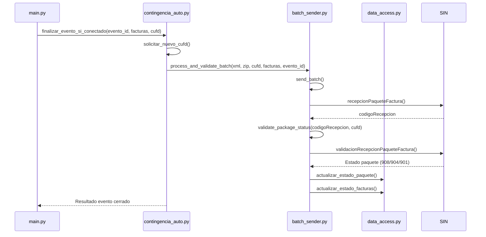

# 📋 Instrucciones para Implementar Validación y Actualización de Paquetes en Facturación Offline

Este documento es una guía para completar el flujo de **envío y validación de paquetes offline** en el proyecto de facturación electrónica avanzando en la implementación de los puntos pendientes definidos en el archivo `ANALISIS_CUMPLIMIENTO_NORMATIVO.md` del proyecto.

---

## 1. Objetivo

Completar el ciclo normativo después de la contingencia:

1. **Enviar** paquete con `recepcionPaqueteFactura`.
2. **Validar** con `validacionRecepcionPaqueteFactura`.
3. **Actualizar** estado en tablas `eventos_significativos_registrados` y `factura_cabecera`.

---

## 2. Cambios en `batch_sender.py`

### 2.1 Crear función de validación

```python
def validate_package_status(self, codigo_recepcion, cufd):
    client = self._get_client("FacturaCompraVenta")
    solicitud = {
        'codigoAmbiente': self.config['codigoAmbiente'],
        'codigoSistema': self.config['codigoSistema'],
        'codigoSucursal': self.config['codigoSucursal'],
        'codigoPuntoVenta': self.config.get('codigoPuntoVenta', 0),
        'cuis': self.config['cuis'],
        'cufd': cufd,
        'nit': self.config['nit'],
        'codigoRecepcion': codigo_recepcion
    }
    try:
        response = client.service.validacionRecepcionPaqueteFactura(**solicitud)
        logging.info(f"[📡] Respuesta validación paquete: {response}")
        return response
    except Exception as e:
        logging.error(f"[❌] Error al validar paquete {codigo_recepcion}: {e}")
        return None
```

### 2.2 Orquestador de envío y validación

```python
def process_and_validate_batch(self, xml_path, gzip_path, cufd, batch_numbers, evento_id):
    response = self.send_batch(xml_path, gzip_path, cufd, batch_numbers)
    if not response or not getattr(response, "codigoRecepcion", None):
        logging.error("[❌] No se obtuvo codigoRecepcion en el envío del paquete.")
        return False

    codigo_recepcion = response.codigoRecepcion
    result = self.validate_package_status(codigo_recepcion, cufd)
    if not result:
        return False

    if getattr(result, "transaccion", False):
        estado_paquete = "VALIDADO"
    elif hasattr(result, "mensajesList") and result.mensajesList:
        estado_paquete = "OBSERVADO"
    else:
        estado_paquete = "PENDIENTE"

    actualizar_estado_paquete(evento_id, codigo_recepcion, estado_paquete)
    actualizar_estado_facturas(batch_numbers, codigo_recepcion, estado_paquete)

    logging.info(f"[📦] Paquete {codigo_recepcion} validado con estado: {estado_paquete}")
    return True
```

---

## 3. Cambios en `data_access.py`

### 3.1 Actualizar estado de evento

```python
def actualizar_estado_paquete(evento_id, codigo_recepcion, estado_paquete):
    session = SessionLocal()
    try:
        session.execute(
            text("""
                UPDATE eventos_significativos_registrados
                SET codigo_recepcion = :codigo_recepcion,
                    fecha_fin = NOW()
                WHERE id = :evento_id
            """),
            {"codigo_recepcion": codigo_recepcion, "evento_id": evento_id}
        )
        session.commit()
    finally:
        session.close()
```

### 3.2 Actualizar facturas

```python
def actualizar_estado_facturas(batch_numbers, codigo_recepcion, estado_paquete):
    session = SessionLocal()
    try:
        session.execute(
            text("""
                UPDATE factura_cabecera
                SET codigoRecepcion = :codigo_recepcion,
                    estadoContingencia = :estado_paquete,
                    fechaSincronizacion = NOW()
                WHERE numeroFactura IN :facturas
            """),
            {"codigo_recepcion": codigo_recepcion, "estado_paquete": estado_paquete, "facturas": tuple(batch_numbers)}
        )
        session.commit()
    finally:
        session.close()
```

---

## 4. Cambios en `contingencia_auto.py`

### 4.1 Integrar orquestador al finalizar evento

```python
def finalizar_evento_si_conectado(evento_id, facturas, cufd):
    logging.info(f"[📡] Conexión restablecida. Finalizando evento #{evento_id}...")

    nuevo_cufd = solicitar_nuevo_cufd()
    if not nuevo_cufd:
        logging.error("[❌] No se pudo obtener nuevo CUFD.")
        return False

    sender = BatchSender()
    ok = sender.process_and_validate_batch(
        xml_path=f"paquetes_contingencia/evento_{evento_id}.xml",
        gzip_path=f"paquetes_contingencia/evento_{evento_id}.zip",
        cufd=nuevo_cufd["codigo"],
        batch_numbers=facturas,
        evento_id=evento_id
    )

    if ok:
        logging.info(f"[✅] Evento #{evento_id} finalizado exitosamente.")
    else:
        logging.error(f"[❌] Fallo en validación/envío del evento #{evento_id}.")
```

---

## 5. Diagrama de Flujo



---

## 6. Resultados esperados

* Facturas offline ya no quedarán colgadas en `PENDIENTE_ENVIO`.
* Cada paquete tendrá un estado normativo: `VALIDADO`, `OBSERVADO` o `PENDIENTE`.
* Eventos cerrados con `codigo_recepcion` y `fecha_fin` correctos.
