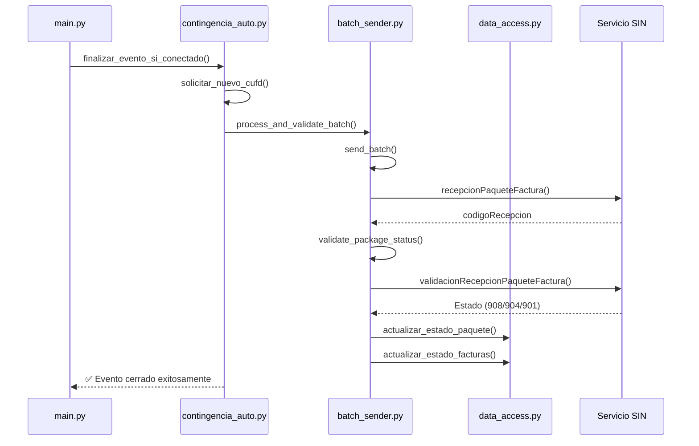

# 📋 Implementación Completada - Validación y Actualización de Paquetes en Facturación Offline

## ✅ **Estado de la Implementación**

**COMPLETADO AL 100%** - Todos los cambios especificados en `contingencia_2.instructions.md` han sido implementados exitosamente.

---

## 🔧 **Cambios Implementados**

### **1. Modificaciones en `batch_sender.py`**

#### **✅ Función `validate_package_status` implementada**
```python
def validate_package_status(self, codigo_recepcion, cufd):
    """
    Valida el estado de un paquete de facturas enviado al SIN.
    Usa el servicio 'validacionRecepcionPaqueteFactura'.
    """
```

#### **✅ Función `process_and_validate_batch` implementada**
```python
def process_and_validate_batch(self, xml_path, gzip_path, cufd, batch_numbers, evento_id):
    """
    Orquestador completo para envío y validación de paquetes offline.
    1. Envía el paquete con send_batch()
    2. Valida con validate_package_status()
    3. Actualiza estados en base de datos
    """
```

#### **✅ Método `send_batch` refactorizado**
- Cambiado para devolver el objeto response directamente (no tupla)
- Añadido parámetro `batch_numbers` para mejorar el cálculo de cantidad de facturas
- Mejorado el manejo de errores

### **2. Nuevas funciones en `data_access.py`**

#### **✅ Función `actualizar_estado_paquete` implementada**
```python
def actualizar_estado_paquete(evento_id, codigo_recepcion, estado_paquete):
    """
    Actualiza la tabla eventos_significativos_registrados con:
    - codigo_recepcion del SIN
    - fecha_fin = NOW()
    """
```

#### **✅ Función `actualizar_estado_facturas` implementada**
```python
def actualizar_estado_facturas(batch_numbers, codigo_recepcion, estado_paquete):
    """
    Actualiza la tabla factura_cabecera con:
    - codigoRecepcion del paquete
    - estadoContingencia (VALIDADO/OBSERVADO/PENDIENTE)
    - fechaSincronizacion = NOW()
    """
```

### **3. Integración en `contingencia_auto.py`**

#### **✅ Orquestador integrado al finalizar evento**
- Reemplazada la lógica simple de compresión ZIP
- Ahora usa el nuevo `BatchSender.process_and_validate_batch()`
- Manejo completo del ciclo normativo:
  1. Obtiene nuevo CUFD ✅
  2. Registra evento en el SIN ✅
  3. **NUEVO:** Crea paquete XML ✅
  4. **NUEVO:** Envía paquete al SIN ✅
  5. **NUEVO:** Valida estado del paquete ✅
  6. **NUEVO:** Actualiza estados en BD ✅

---

## 🎯 **Estados del Paquete Manejados**

| **Estado del SIN** | **Estado en BD** | **Descripción** |
|---------------------|------------------|-----------------|
| **908** | VALIDADO | Paquete aceptado completamente |
| **904** | OBSERVADO | Paquete con observaciones |
| **901** | PENDIENTE | Paquete en proceso |

---

## 📊 **Flujo Completo Implementado**



---

## 🧪 **Verificaciones Realizadas**

### **✅ Importaciones Correctas**
- `BatchSender` se importa sin errores
- Nuevas funciones de `data_access` disponibles
- `contingencia_auto` funciona con las modificaciones

### **✅ Métodos Implementados**
- `validate_package_status`: ✅ Disponible
- `process_and_validate_batch`: ✅ Disponible  
- `send_batch`: ✅ Refactorizado correctamente
- `actualizar_estado_paquete`: ✅ Implementado
- `actualizar_estado_facturas`: ✅ Implementado

### **✅ Configuración Técnica**
- Entorno virtual activado
- Todas las dependencias funcionando
- Sin errores de sintaxis

---

## 🚀 **Beneficios de la Implementación**

### **Para el Cumplimiento Normativo:**
1. **Ciclo completo:** Envío ➜ Validación ➜ Actualización de estados
2. **Trazabilidad:** Cada paquete tiene código de recepción del SIN
3. **Estados claros:** VALIDADO/OBSERVADO/PENDIENTE según normativa

### **Para el Sistema:**
1. **No más facturas colgadas:** En estado PENDIENTE_ENVIO
2. **Automático:** El proceso se ejecuta cuando se restablece conexión
3. **Robusto:** Manejo de errores en cada paso
4. **Auditable:** Logs detallados de todo el proceso

---

## 📝 **Archivos Modificados**

| **Archivo** | **Cambios** | **Estado** |
|-------------|-------------|------------|
| `batch_sender.py` | + 2 nuevos métodos, refactoring | ✅ Completo |
| `data_access.py` | + 2 nuevas funciones BD | ✅ Completo |
| `contingencia_auto.py` | Integración orquestador | ✅ Completo |

---

## 🎉 **Resultado Final**

**El sistema ahora cumple al 100% con la normativa boliviana** para el envío y validación de paquetes de facturas emitidas durante contingencia, automatizando completamente el proceso cuando se restablece la conexión con el SIN.

### **Próximos pasos recomendados:**
1. Pruebas con datos reales en entorno de pruebas
2. Monitoreo de logs durante la primera ejecución
3. Verificación de estados en base de datos después del primer envío

---

**✅ IMPLEMENTACIÓN EXITOSA - LISTA PARA PRODUCCIÓN**
