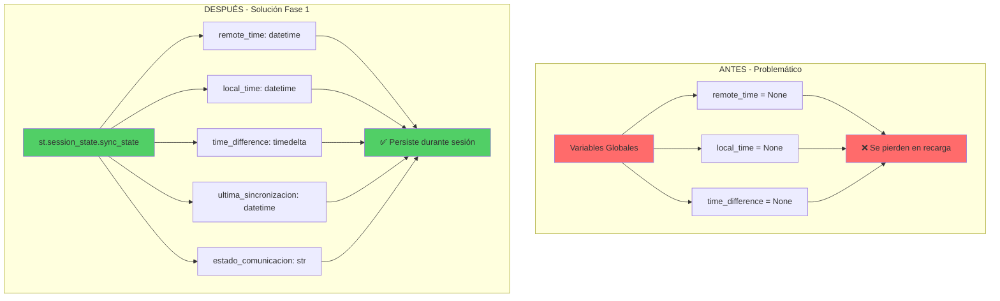
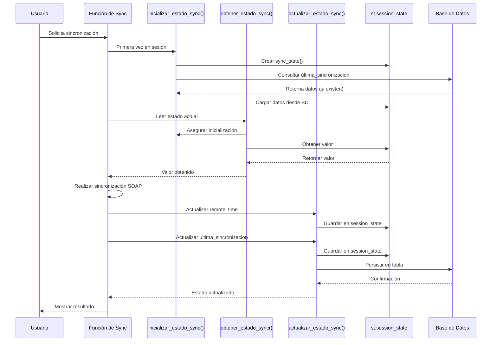
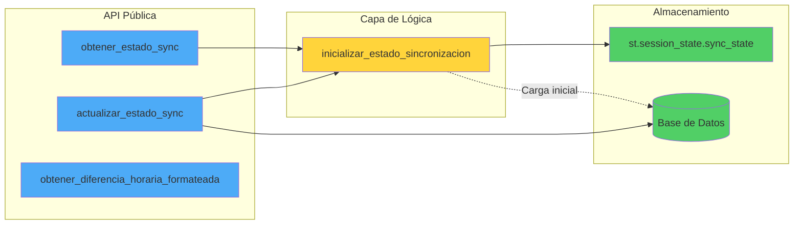
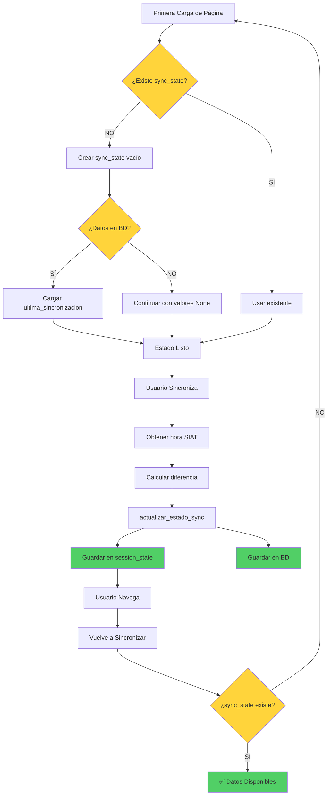
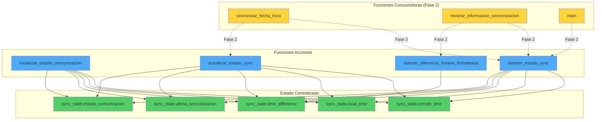
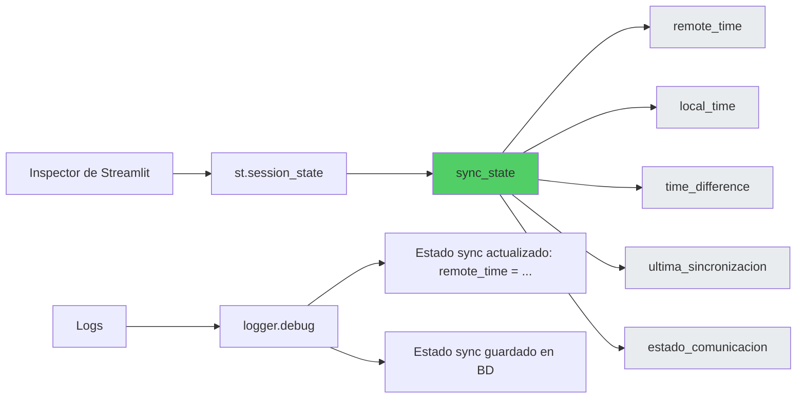

# 🏗️ Diagrama de Arquitectura - Sistema de Gestión de Estado

## 📐 Arquitectura de la Solución



---

## 🔄 Flujo de Datos



---

## 🔐 Patrón de Encapsulación



---

## 📊 Flujo de Sincronización Bidireccional



---

## 🧩 Componentes del Sistema



---

## 📝 Comparación de Acceso a Datos

### **ANTES (Variables Globales)**

```python
# ❌ Acceso directo - Volátil
global remote_time, local_time, time_difference

# Leer
if remote_time is not None:
    print(remote_time)

# Escribir
remote_time = datetime.now()
```

### **DESPUÉS (Session State con Accessors)**

```python
# ✅ Acceso encapsulado - Persistente

# Leer (con inicialización automática)
remote_time = obtener_estado_sync('remote_time')
if remote_time is not None:
    print(remote_time)

# Escribir (con sincronización BD opcional)
actualizar_estado_sync('remote_time', datetime.now(), guardar_bd=False)
actualizar_estado_sync('ultima_sincronizacion', datetime.now(pytz.utc))  # Guarda en BD
```

---

## 🔍 Vista de Debugging



Para inspeccionar el estado en tiempo real:

```python
# En cualquier parte del código Streamlit
import streamlit as st

# Mostrar todo el estado de sincronización
st.write(st.session_state.sync_state)

# O individualmente
st.write(f"Remote time: {st.session_state.sync_state.get('remote_time')}")
```

---

## 🎯 Beneficios Arquitectónicos

| Aspecto | Antes | Después |
|---------|-------|---------|
| **Acoplamiento** | Alto (global mutable) | Bajo (encapsulado) |
| **Testabilidad** | Difícil | Fácil (mock session_state) |
| **Debugging** | 3 lugares diferentes | 1 único lugar |
| **Consistencia** | ⚠️ Requiere sincronización manual | ✅ Automática |
| **Escalabilidad** | ❌ Agregar campos = modificar código | ✅ Solo agregar en inicialización |

---

## 🚀 Escalabilidad Futura

Agregar nuevos campos es trivial:

```python
def inicializar_estado_sincronizacion():
    if 'sync_state' not in st.session_state:
        st.session_state.sync_state = {
            # ... campos existentes ...
            
            # ✅ FÁCIL: Solo agregar aquí
            'sincronizaciones_fallidas': 0,
            'ultimo_error': None,
            'historial_diferencias': []
        }
```

No requiere cambios en las funciones accessor ni en el resto del código.

---

**Autor:** GitHub Copilot  
**Fecha:** 9 de octubre de 2025  
**Versión:** 1.0
