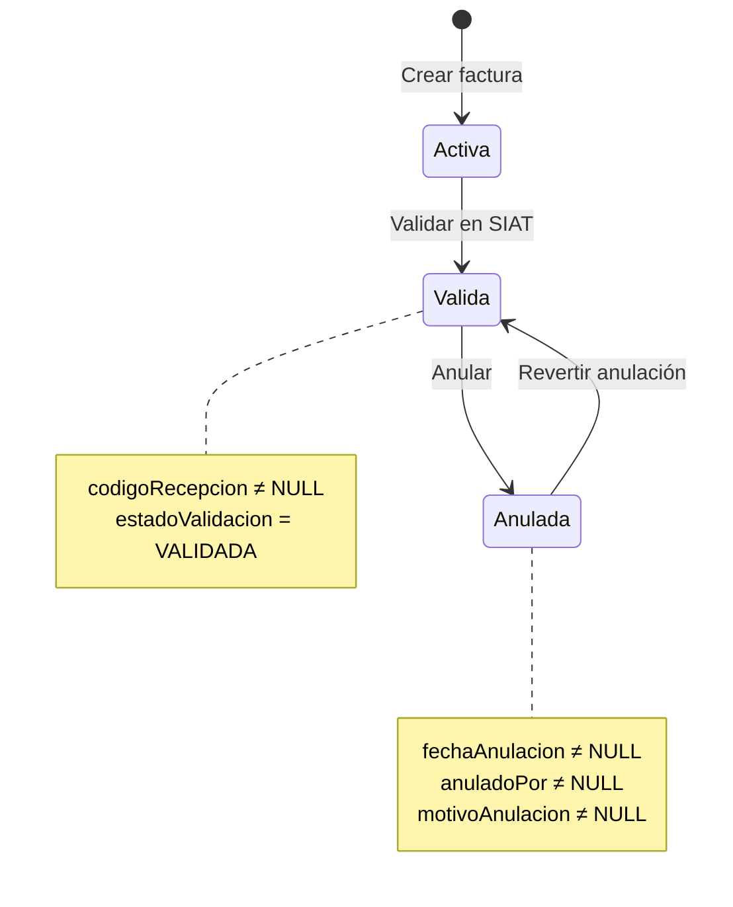

# 📋 Documentación: Tabla `factura_cabecera`

**Base de datos:** `adminerp_copy`  
**Tabla:** `factura_cabecera`  
**Motor:** InnoDB  
**Charset:** utf8mb4_unicode_ci

---

## 🏗️ Estructura Completa

### Índices y Claves

```sql
PRIMARY KEY: numeroFactura
UNIQUE INDEX: cuf
FOREIGN KEY: codigoEvento → eventos_significativos_registrados(id)
INDEX: idx_factura_codigo_evento
```

---

## 📊 Columnas - Documentación Detallada

### 🔑 Identificación de la Factura

| Columna | Tipo | Nulo | Default | Descripción Detallada |
|---------|------|------|---------|----------------------|
| **numeroFactura** | INT(11) | NO | - | **Número secuencial de la factura.** Es la clave primaria. Se genera automáticamente incrementando el último número usado. No puede repetirse. |
| **cuf** | VARCHAR(100) | NO | - | **Código Único de Facturación (CUF).** Identificador único generado para cada factura según normativa SIAT. Se compone de: NIT + fecha + sucursal + modalidad + tipo + sector + número factura + punto venta + código de control. Es único a nivel nacional. |

**Ejemplo:**
```
numeroFactura: 777
cuf: 3394632011112503810001123456789012345678901234567890
```

---

### 🏢 Datos del Emisor

| Columna | Tipo | Nulo | Default | Descripción Detallada |
|---------|------|------|---------|----------------------|
| **nitEmisor** | BIGINT(20) | NO | - | **NIT del emisor** de la factura (la empresa que emite). Debe coincidir con el NIT registrado ante Impuestos. |
| **razonSocialEmisor** | VARCHAR(200) | NO | - | **Nombre o razón social del emisor.** Es el nombre legal de la empresa tal como aparece en el registro tributario. |
| **municipio** | VARCHAR(25) | NO | - | **Municipio donde se ubica** el establecimiento emisor. Ej: "La Paz", "Santa Cruz", "Cochabamba". |
| **telefono** | VARCHAR(25) | SÍ | NULL | **Teléfono de contacto** del establecimiento emisor. Puede incluir código de área. |
| **direccion** | VARCHAR(500) | NO | - | **Dirección física completa** del establecimiento emisor. Incluye calle, número, zona. |
| **codigoSucursal** | INT(11) | NO | - | **Código de la sucursal** donde se emite la factura. 0 = Casa matriz, 1,2,...,n = Sucursales. |
| **codigoPuntoVenta** | INT(11) | SÍ | NULL | **Código del punto de venta** dentro de la sucursal. 0 = Sin punto de venta específico, 1,2,...,n = Puntos de venta. |

**Ejemplo:**
```
nitEmisor: 3394632011
razonSocialEmisor: "MI EMPRESA S.R.L."
municipio: "La Paz"
telefono: "2-2345678"
direccion: "Av. Camacho #1234, Zona Centro"
codigoSucursal: 0
codigoPuntoVenta: 1
```

---

### 👤 Datos del Cliente

| Columna | Tipo | Nulo | Default | Descripción Detallada |
|---------|------|------|---------|----------------------|
| **nombreRazonSocial** | VARCHAR(500) | SÍ | NULL | **Nombre o razón social del cliente** que compra. Para personas naturales es el nombre completo. Para empresas es la razón social. |
| **codigoTipoDocumentoIdentidad** | INT(11) | NO | - | **Código del tipo de documento** del cliente. Valores: 1=CI, 2=CEX, 3=PAS, 4=OD, 5=NIT. Referencia a tabla de parámetros SIAT. |
| **numeroDocumento** | VARCHAR(20) | NO | - | **Número del documento** de identidad del cliente. Para NIT incluye dígito verificador. |
| **complemento** | VARCHAR(5) | SÍ | NULL | **Complemento del CI** del cliente. Ej: "1A", "2B". Solo aplica para CI boliviano. |
| **codigoCliente** | VARCHAR(100) | NO | - | **Código interno del cliente** en el sistema. Puede ser generado automáticamente o asignado manualmente. |

**Ejemplo:**
```
nombreRazonSocial: "Juan Pérez Mamani"
codigoTipoDocumentoIdentidad: 1  // CI
numeroDocumento: "7654321"
complemento: "1A"
codigoCliente: "CLI-0001"
```

---

### 💰 Montos y Totales

| Columna | Tipo | Nulo | Default | Descripción Detallada |
|---------|------|------|---------|----------------------|
| **montoTotal** | DECIMAL(17,2) | NO | - | **Monto total de la factura** en Bolivianos. Incluye todos los impuestos. Es el valor final a pagar. |
| **montoTotalSujetoIva** | DECIMAL(17,2) | NO | - | **Monto sobre el cual se calcula el IVA.** Es la base imponible antes de aplicar el 13% de IVA. |
| **codigoMoneda** | INT(11) | NO | 1 | **Código de la moneda** usada. 1 = Bolivianos (BOB), 2 = Dólares (USD). Referencia a tabla de parámetros SIAT. |
| **tipoCambio** | DECIMAL(17,2) | NO | 1.00 | **Tipo de cambio** aplicado. Si es en Bolivianos, es 1.00. Si es en otra moneda, es el tipo de cambio del día. |
| **montoTotalMoneda** | DECIMAL(17,2) | NO | - | **Monto total en la moneda especificada.** Si es en Bolivianos, coincide con montoTotal. |
| **montoGiftCard** | DECIMAL(17,2) | SÍ | NULL | **Monto pagado con tarjeta de regalo** o gift card. Si no se usó, es NULL. |
| **descuentoAdicional** | DECIMAL(17,2) | NO | 0.00 | **Descuento adicional** aplicado al total de la factura. Es un descuento global, no por producto. |

**Ejemplo:**
```
montoTotal: 1130.00              // Total final
montoTotalSujetoIva: 1000.00     // Base para IVA (13% = 130)
codigoMoneda: 1                  // Bolivianos
tipoCambio: 1.00                 // 1 BOB = 1 BOB
montoTotalMoneda: 1130.00        // Mismo que montoTotal
montoGiftCard: NULL              // No se usó gift card
descuentoAdicional: 0.00         // Sin descuento global
```

---

### 💳 Método de Pago

| Columna | Tipo | Nulo | Default | Descripción Detallada |
|---------|------|------|---------|----------------------|
| **codigoMetodoPago** | INT(11) | NO | - | **Código del método de pago.** Valores: 1=Efectivo, 2=Tarjeta, 3=Cheque, etc. Referencia a tabla de parámetros SIAT. |
| **numeroTarjeta** | BIGINT(20) | SÍ | NULL | **Últimos 4 dígitos de la tarjeta** (si se pagó con tarjeta). Por seguridad, no se guarda el número completo. |

**Ejemplo:**
```
codigoMetodoPago: 1       // Efectivo
numeroTarjeta: NULL       // No aplica para efectivo

// O si fue con tarjeta:
codigoMetodoPago: 2       // Tarjeta
numeroTarjeta: 1234       // Últimos 4 dígitos
```

---

### 📅 Fechas y Timestamps

| Columna | Tipo | Nulo | Default | Descripción Detallada |
|---------|------|------|---------|----------------------|
| **fechaEmision** | DATETIME | NO | - | **Fecha y hora de emisión** de la factura. Es el momento exacto en que se generó el documento fiscal. Formato: YYYY-MM-DD HH:MM:SS. |
| **fechaCreacion** | TIMESTAMP | NO | CURRENT_TIMESTAMP | **Fecha de creación del registro** en la base de datos. Se asigna automáticamente al insertar. |
| **fechaActualizacion** | TIMESTAMP | NO | CURRENT_TIMESTAMP ON UPDATE | **Fecha de última modificación** del registro. Se actualiza automáticamente cada vez que se modifica cualquier campo. |
| **fechaValidacion** | TIMESTAMP | SÍ | NULL | **Fecha y hora de validación** por parte del SIAT. Se asigna cuando el SIAT confirma la factura. |
| **fechaAnulacion** | DATETIME | SÍ | NULL | **Fecha y hora de anulación** de la factura. Solo tiene valor si la factura fue anulada. |
| **fechaErrorFirma** | TIMESTAMP | SÍ | NULL | **Fecha del último error** en el proceso de firma digital. |
| **fechaInicioEvento** | DATETIME | SÍ | NULL | **Fecha de inicio del evento significativo** asociado a esta factura (solo para facturas offline/contingencia). |
| **fechaFinEvento** | DATETIME | SÍ | NULL | **Fecha de fin del evento significativo.** Indica cuándo terminó la contingencia. |
| **fechaSincronizacion** | DATETIME | SÍ | NULL | **Fecha en que se sincronizó** la factura offline con el SIAT después de la contingencia. |
| **fecha_verificacion** | DATETIME | SÍ | NULL | **Fecha de última verificación** del estado de la factura en el SIAT. |

---

### 🔐 Códigos de Seguridad y Control SIAT

| Columna | Tipo | Nulo | Default | Descripción Detallada |
|---------|------|------|---------|----------------------|
| **cufd** | VARCHAR(100) | NO | - | **Código Único de Facturación Diaria (CUFD).** Es un código que el SIAT asigna diariamente. Todas las facturas del día usan el mismo CUFD. Tiene vigencia de 24 horas. |
| **cuis** | VARCHAR(100) | SÍ | - | **Código Único de Inicio de Sistemas (CUIS).** Se solicita una vez al registrar el sistema de facturación. Identifica de forma única al sistema y punto de venta. |
| **codigoExcepcion** | INT(11) | SÍ | NULL | **Código de excepción.** Valor 1 cuando el cliente es NIT y la factura es offline. NULL en caso contrario. Requerido por normativa SIAT. |
| **cafc** | VARCHAR(50) | SÍ | NULL | **Código de Autorización de Facturas en Contingencia (CAFC).** Solo se usa para facturas manuales en contingencia. NULL para facturas normales. |
| **codigoRecepcion** | VARCHAR(255) | SÍ | NULL | **Código de recepción** asignado por el SIAT al aceptar la factura. Es la "prueba" de que el SIAT recibió y validó la factura. **MUY IMPORTANTE:** Si esta columna es NULL, significa que la factura NO fue confirmada por el SIAT. |

**Ejemplo (Factura Online Normal):**
```
cufd: "ABCD1234EFGH5678=="
cuis: "XYZ9876=="
codigoExcepcion: NULL
cafc: NULL
codigoRecepcion: "RCP-20251016-123456"  // ✅ Factura confirmada
```

**Ejemplo (Factura Offline con problema):**
```
cufd: "ABCD1234EFGH5678=="
cuis: "XYZ9876=="
codigoExcepcion: 1
cafc: NULL
codigoRecepcion: NULL  // ❌ No confirmada por SIAT
```

---

### 📝 Información Adicional

| Columna | Tipo | Nulo | Default | Descripción Detallada |
|---------|------|------|---------|----------------------|
| **leyenda** | VARCHAR(200) | NO | - | **Leyenda fiscal obligatoria** en la factura. Se selecciona aleatoriamente de una lista de leyendas aprobadas por el SIAT. Ej: "Este documento es la única prueba válida del crédito fiscal". |
| **usuario** | VARCHAR(100) | NO | - | **Usuario que emitió** la factura. Es el nombre de usuario del sistema que generó el documento. |
| **codigoDocumentoSector** | INT(11) | NO | 1 | **Código del sector** de la actividad. 1 = Compra-venta, 8 = Hoteles, 23 = Alquiler de vehículos, etc. Define qué campos adicionales requiere la factura. |

---

### ✍️ Firma Digital

| Columna | Tipo | Nulo | Default | Descripción Detallada |
|---------|------|------|---------|----------------------|
| **detallesFirmaDigital** | TEXT | SÍ | NULL | **Detalles técnicos de la firma digital** aplicada al XML de la factura. Incluye hash, algoritmo, certificado usado. |
| **estadoFirma** | VARCHAR(20) | NO | 'Pendiente' | **Estado del proceso de firma.** Valores: "Pendiente", "Firmada", "Error". Indica si el XML fue firmado correctamente. |
| **mensajeErrorFirma** | TEXT | SÍ | NULL | **Mensaje de error** si hubo problemas al firmar el XML. Ayuda a diagnosticar problemas con el certificado o el proceso de firma. |
| **intentosFirma** | INT(11) | NO | 0 | **Número de intentos** de firma realizados. Se incrementa cada vez que se intenta firmar. Útil para detectar problemas recurrentes. |

---

### ✅ Estados y Validaciones

| Columna | Tipo | Nulo | Default | Descripción Detallada |
|---------|------|------|---------|----------------------|
| **estado** | VARCHAR(20) | NO | 'Activa' | **Estado actual de la factura.** Valores principales: "Activa", "Valida", "Anulada", "Revertida". **CRÍTICO:** Este es el campo que determina si una factura puede ser revertida. |
| **estadoValidacion** | VARCHAR(50) | NO | 'VALIDADA' | **Estado de la validación SIAT.** Valores: "VALIDADA", "OBSERVADA", "RECHAZADA", "PENDIENTE". Indica si el SIAT aceptó la factura. |
| **resultadoValidacion** | VARCHAR(100) | SÍ | NULL | **Descripción del resultado** de la validación SIAT. Puede contener códigos de error o mensajes explicativos. |
| **estadoPaquete** | VARCHAR(20) | SÍ | NULL | **Estado del paquete** (para facturas offline enviadas en lote). Valores: "PENDIENTE", "PROCESADO", "ERROR". |
| **estadoContingencia** | VARCHAR(20) | SÍ | NULL | **Estado de sincronización** de facturas de contingencia. Valores: "PENDIENTE", "SINCRONIZADO", "ERROR". |

**Diferencia clave:**
```
estado:           Ciclo de vida completo (Activa → Anulada → Revertida)
estadoValidacion: Solo validación técnica del SIAT (VALIDADA/RECHAZADA)
```

**Ejemplo:**
```
// Factura normal activa:
estado: "Valida"
estadoValidacion: "VALIDADA"
resultadoValidacion: "908 - VALIDADA"

// Factura anulada:
estado: "Anulada"
estadoValidacion: "VALIDADA"  // La factura original fue válida
resultadoValidacion: "908 - VALIDADA"
```

---

### ❌ Manejo de Errores

| Columna | Tipo | Nulo | Default | Descripción Detallada |
|---------|------|------|---------|----------------------|
| **mensajeError** | TEXT | SÍ | NULL | **Mensaje de error general** de la factura. Puede contener errores de validación, problemas de comunicación con SIAT, etc. |
| **enlaceSiat** | VARCHAR(255) | SÍ | NULL | **URL de consulta** de la factura en el portal del SIAT. Permite verificar manualmente el estado de la factura. |

---

### 🔄 Contingencia y Eventos

| Columna | Tipo | Nulo | Default | Descripción Detallada |
|---------|------|------|---------|----------------------|
| **tipoEmision** | VARCHAR(10) | SÍ | NULL | **Tipo de emisión** de la factura. "1" = Online (en línea), "2" = Offline (contingencia). **CRÍTICO:** Determina si se debe enviar codigoEvento en operaciones posteriores. |
| **codigoEvento** | INT(11) | SÍ | NULL | **ID del evento significativo** registrado (solo para facturas offline). Es una clave foránea a la tabla `eventos_significativos_registrados`. |
| **descripcionEvento** | VARCHAR(255) | SÍ | NULL | **Descripción del evento significativo.** Ej: "Corte de energía eléctrica", "Falla en conexión a internet", etc. |
| **idPaquete** | VARCHAR(50) | SÍ | NULL | **Identificador del paquete** al que pertenece esta factura (para emisión masiva offline). Un paquete puede contener hasta 500 facturas. |
| **numeroSecuencia** | INT(11) | SÍ | NULL | **Número de secuencia** dentro del paquete. Indica la posición de esta factura dentro del paquete. |

**Ejemplo (Factura Online):**
```
tipoEmision: "1"
codigoEvento: NULL
descripcionEvento: NULL
idPaquete: NULL
numeroSecuencia: NULL
```

**Ejemplo (Factura Offline en Paquete):**
```
tipoEmision: "2"
codigoEvento: 5                    // FK a eventos_significativos_registrados
descripcionEvento: "Corte de luz"
idPaquete: "PKG-20251016-001"
numeroSecuencia: 45                // Factura #45 del paquete
```

---

### 🔍 Verificación Post-Contingencia

| Columna | Tipo | Nulo | Default | Descripción Detallada |
|---------|------|------|---------|----------------------|
| **requiere_verificacion** | TINYINT(1) | SÍ | 0 | **Flag que indica** si esta factura necesita ser verificada después de una contingencia. 1 = Requiere verificación, 0 = No requiere. |
| **resultado_verificacion** | VARCHAR(255) | SÍ | NULL | **Resultado de la verificación** del estado de la factura en el SIAT. Puede contener el estado devuelto por el servicio de verificación. |

---

### 👥 Auditoría

| Columna | Tipo | Nulo | Default | Descripción Detallada |
|---------|------|------|---------|----------------------|
| **creadoPor** | VARCHAR(100) | NO | 'ADMIN' | **Usuario que creó** el registro inicial en la base de datos. Nombre de usuario del sistema. |
| **actualizadoPor** | VARCHAR(100) | NO | 'ADMIN' | **Usuario que realizó** la última modificación. Se actualiza automáticamente en cada UPDATE. |
| **anuladoPor** | VARCHAR(100) | SÍ | NULL | **Usuario que anuló** la factura. Solo tiene valor si la factura fue anulada. |
| **motivoAnulacion** | TEXT | SÍ | NULL | **Motivo de la anulación.** Explicación del por qué se anuló la factura. Ej: "FACTURA MAL EMITIDA", "ERROR EN EL MONTO", etc. |

**Ejemplo:**
```
creadoPor: "admin"
actualizadoPor: "operador1"
anuladoPor: "supervisor"
motivoAnulacion: "FACTURA MAL EMITIDA"
```

---

## 🚨 Campos Críticos para Diagnóstico

Cuando una factura tiene problemas, estos son los campos clave a revisar:

### Para Problemas de Reversión

| Campo | Qué Verificar |
|-------|---------------|
| `estado` | Debe ser "Anulada" para poder revertir |
| `codigoRecepcion` | **NO debe ser NULL**. Si es NULL, la anulación no se completó |
| `tipoEmision` | "1" = online, "2" = offline |
| `codigoEvento` | Solo debe tener valor si tipoEmision = "2" |

**Checklist de Diagnóstico:**
```sql
SELECT 
    numeroFactura,
    estado,                    -- ¿Es "Anulada"?
    codigoRecepcion,          -- ¿Es NULL? ← PROBLEMA
    tipoEmision,              -- ¿Es "1" o "2"?
    codigoEvento,             -- Solo si tipoEmision="2"
    fechaAnulacion,           -- ¿Cuándo se anuló?
    resultado_verificacion    -- ¿Qué dice el SIAT?
FROM factura_cabecera 
WHERE numeroFactura = 777;
```

### Para Problemas de Sincronización

| Campo | Qué Verificar |
|-------|---------------|
| `estado` vs SIAT | ¿Coinciden? |
| `codigoRecepcion` | Si es NULL → No confirmada |
| `estadoValidacion` | ¿Dice "VALIDADA"? |
| `mensajeError` | ¿Hay errores registrados? |

---

## 📈 Estados del Ciclo de Vida



---

## ⚠️ Valores Especiales y Casos de Uso

### NULL vs Valor por Defecto

| Columna | NULL | Valor Default | Significado |
|---------|------|---------------|-------------|
| `codigoRecepcion` | NULL | - | ❌ **Factura NO confirmada por SIAT** |
| `codigoRecepcion` | "ABC123" | - | ✅ Factura confirmada |
| `codigoEvento` | NULL | - | ✅ Factura online (normal) |
| `codigoEvento` | 5 | - | ⚠️ Factura offline (contingencia) |
| `codigoExcepcion` | NULL | - | ✅ Factura normal o cliente sin NIT |
| `codigoExcepcion` | 1 | - | ⚠️ Cliente con NIT en factura offline |

### Combinaciones Válidas

**Factura Online Normal (Caso más común):**
```
tipoEmision: "1"
codigoEvento: NULL
codigoExcepcion: NULL
cafc: NULL
codigoRecepcion: "RCP-..." ← Debe tener valor
```

**Factura Offline en Contingencia:**
```
tipoEmision: "2"
codigoEvento: 5 ← Debe tener valor
codigoExcepcion: 1 (si cliente es NIT)
cafc: NULL
codigoRecepcion: NULL (hasta sincronizar)
```

---

## 🔧 Consultas SQL Útiles

### Verificar Facturas con Inconsistencias

```sql
-- Facturas marcadas como anuladas sin código de recepción
SELECT numeroFactura, estado, codigoRecepcion, fechaAnulacion
FROM factura_cabecera
WHERE estado = 'Anulada' 
  AND codigoRecepcion IS NULL;
```

### Facturas de Contingencia Pendientes

```sql
-- Facturas offline que no se han sincronizado
SELECT numeroFactura, tipoEmision, estadoContingencia, fechaEmision
FROM factura_cabecera
WHERE tipoEmision = '2' 
  AND estadoContingencia = 'PENDIENTE';
```

### Auditoría de Anulaciones

```sql
-- Historial completo de anulaciones
SELECT 
    numeroFactura,
    fechaEmision,
    fechaAnulacion,
    TIMESTAMPDIFF(DAY, fechaEmision, fechaAnulacion) as dias_hasta_anulacion,
    anuladoPor,
    motivoAnulacion,
    codigoRecepcion
FROM factura_cabecera
WHERE estado = 'Anulada'
ORDER BY fechaAnulacion DESC;
```

---

**Última actualización:** 16 de octubre de 2025  
**Versión:** 1.0  
**Mantenido por:** Equipo de Desarrollo - Sistema de Facturación Electrónica
