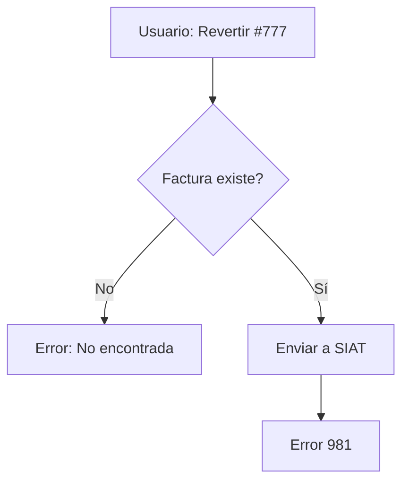
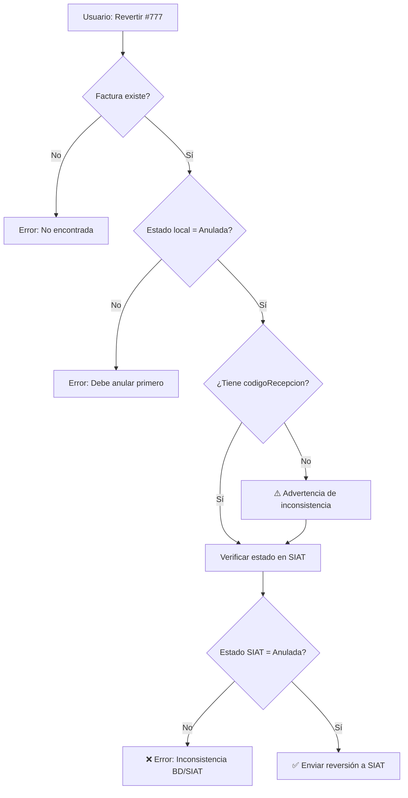
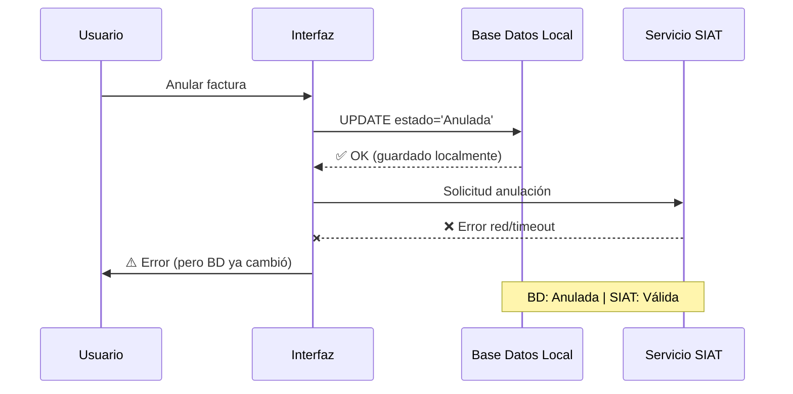
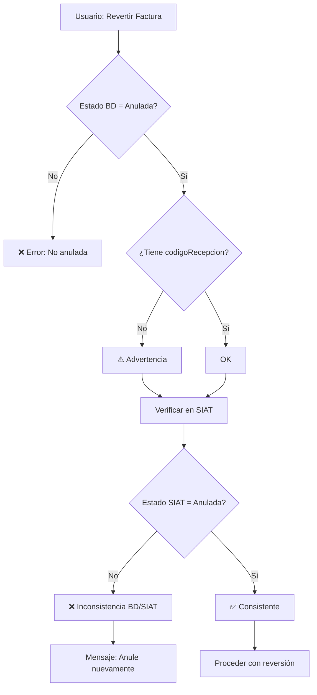
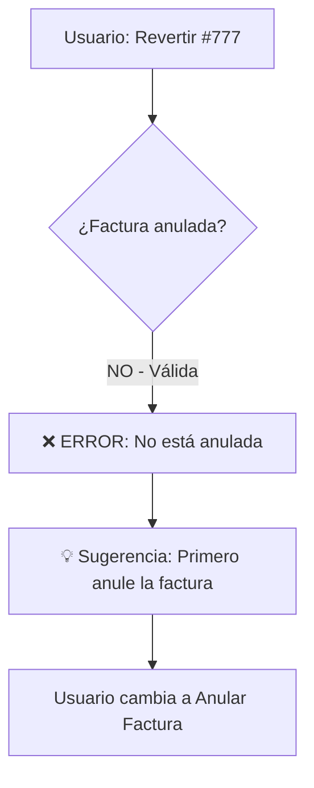
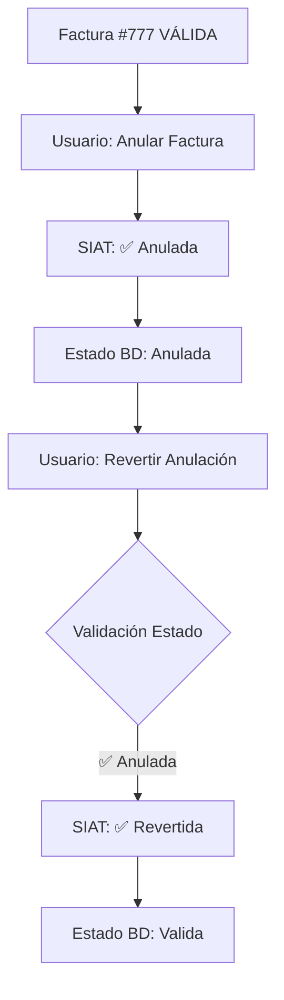

# 🔧 Corrección Error 981: RANGO DE FECHAS DE EVENTO SIGNIFICATIVO INVALIDO

**Fecha:** 16 de octubre de 2025  
**Versión:** reversion.py v2.2.0 + anular_revertir_tab.py v1.1.0  
**Estado:** ✅ Corregido

---

## 📋 Descripción del Problema

### Síntomas
Al intentar revertir la anulación de la **factura #777** (emitida en modo ONLINE), el sistema mostraba el siguiente error:

```
❌ REVERSION DE ANULACION RECHAZADA

Motivos específicos del rechazo:
• [981] RANGO DE FECHAS DE EVENTO SIGNIFICATIVO INVALIDO

Posibles acciones:
• Verifique que la factura esté efectivamente anulada
• Confirme que no haya sido revertida previamente
• La factura pudo haber sido usada en una declaración jurada
```

### Evidencia en Terminal
```
INFO:root:[REVERSION] Codigo: 909, Transaccion: False
INFO:root:[REVERSION] Mensaje adicional [981]: RANGO DE FECHAS DE EVENTO SIGNIFICATIVO INVALIDO...
WARNING:root:[REVERSION] Rechazada para factura #777
```

### Contexto de la Base de Datos
La factura #777 en la tabla `factura_cabecera` mostraba:
- `tipoEmision = "1"` (ONLINE) ✅
- `codigoEvento = NULL` ✅
- `estado = "Valida"` ❌ ← **ESTE ERA EL PROBLEMA REAL**

---

## 🔍 Análisis de la Causa Raíz

### El Problema REAL DESCUBIERTO
El error **981 del SIAT es ENGAÑOSO**. Después de análisis adicional, se descubrió:

**Base de Datos Local:**
```sql
estado: "Anulada"
fechaAnulacion: 16/10/2025 02:51:31
motivoAnulacion: "FACTURA MAL EMITIDA"
codigoRecepcion: NULL  ← ⚠️ PROBLEMA CRÍTICO
```

**Estado en SIAT (verificado):**
```
Estado: "VÁLIDA"  ← ⚠️ INCONSISTENCIA
```

### La Raíz del Problema
Existe una **inconsistencia de sincronización** entre la base de datos local y el SIAT:

1. ✅ La factura se marcó como **"Anulada"** localmente
2. ❌ La anulación **NUNCA SE ENVIÓ/CONFIRMÓ** en el SIAT
3. ❌ No existe `codigoRecepcion` de la anulación
4. ❌ El SIAT mantiene la factura como **"VÁLIDA"**

**Conclusión:** Cuando el usuario intentó revertir, el SIAT rechazó la operación porque desde su perspectiva la factura nunca fue anulada.

### La Secuencia de Eventos
1. **Factura #777 fue emitida** → Estado Local: VÁLIDA | Estado SIAT: VÁLIDA ✅
2. **Usuario intentó anular** → Estado Local: ANULADA | Estado SIAT: **VÁLIDA** ❌ (falló el envío)
3. **Usuario intentó revertir** → SIAT responde error 981 (la factura no está anulada en SIAT)
3. **Usuario intentó revertir la anulación** → ❌ ERROR
4. **Problema:** La factura nunca fue anulada, aún estaba VÁLIDA

### Por Qué el Código 981 es Confuso
Según la documentación oficial del SIAT:
```
https://siatinfo.impuestos.gob.bo/index.php/facturacion-en-linea/implementacion-servicios-facturacion/facturacion-electronica/reversion-anulacion-factura-electronica
```

**Parámetros del servicio `ReversionAnulacionFactura`:**
- `codigoEmision`: **"El valor permitido es: Online: 1"**
- NO menciona `codigoEvento` en la lista de parámetros
- **Requisito implícito:** La factura debe estar en estado ANULADA

El SIAT usa el código 981 para múltiples situaciones:
1. Fechas de evento significativo inválidas (facturas offline)
2. **Factura no anulada intentando revertirse** ← Nuestro caso
3. Factura ya revertida previamente
4. Factura usada en declaración jurada

---

## ✅ La Solución Implementada (Doble Corrección)

### Corrección 1: `reversion.py` v2.2.0

#### Problema Detectado (Falso Positivo Inicial)
El código **SÍ detectaba correctamente** que era una factura online:
```python
INFO:root:[REVERSION] Factura #777: tipoEmision=1, es_offline=False
```

Pero teníamos una **mejora preventiva** para facturas offline que implementamos:

#### Cambios en `construir_solicitud_reversion()`
```python
# ✅ CÓDIGO v2.2.0
session = SessionLocal()
try:
    factura = session.query(FacturaCabecera).filter_by(cuf=cuf).first()
    
    # tipoEmision: "1" = online, "2" = offline
    tipo_emision = factura.tipoEmision or "1"
    es_offline = (tipo_emision == "2")
    
    logger.info(f"[REVERSION] Factura #{factura.numeroFactura}: tipoEmision={tipo_emision}, es_offline={es_offline}")
    
    # Si es offline, necesitamos los datos del evento significativo
    codigo_evento = None
    if es_offline and factura.codigoEvento:
        codigo_evento = factura.codigoEvento
        logger.info(f"[REVERSION] Factura offline con codigoEvento={codigo_evento}")
finally:
    session.close()

# Construir parámetros
parametros = {
    # ... otros parámetros ...
    "codigoEmision": tipo_emision,  # ← Usa el tipoEmision de la factura, no del .env
    # ... otros parámetros ...
}

# ========== NUEVO: Añadir codigoEvento solo si es offline ==========
if es_offline and codigo_evento:
    parametros["codigoEvento"] = str(codigo_evento)
    logger.info(f"[REVERSION] Añadiendo codigoEvento={codigo_evento} al XML (factura offline)")
```

**Beneficios:**
- ✅ Detecta automáticamente el tipo de emisión
- ✅ Solo envía `codigoEvento` para facturas offline
- ✅ Previene errores 981 por parámetros incorrectos en facturas offline futuras

### Corrección 2: `anular_revertir_tab.py` v1.2.0 (SOLUCIÓN DEFINITIVA)

#### El Problema Real Corregido
El código **NO validaba la consistencia** entre la base de datos local y el SIAT antes de intentar revertir.

**Flujo previo (INCORRECTO):**


**Flujo nuevo (CORRECTO):**


#### Código Implementado (DOBLE VALIDACIÓN)

**Validación 1: Estado Local**
```python
# ========== VALIDACIÓN 1: Estado en Base de Datos Local ==========
estado_actual = factura.estado if factura else None
codigo_recepcion_anulacion = factura.codigoRecepcion if factura else None

logger.info(f"[REVERSIÓN] Estado BD local de factura #{numero_factura}: {estado_actual}")
logger.info(f"[REVERSIÓN] Código recepción anulación: {codigo_recepcion_anulacion or 'NO DISPONIBLE'}")

# Verificar que la factura esté anulada localmente
if estado_actual != "Anulada":
    mensaje_error = (
        f"⚠️ **La factura #{numero_factura} no está anulada**\n\n"
        f"**Estado actual:** {estado_actual or 'Desconocido'}\n\n"
        f"**Acción requerida:**\n"
        f"• Solo se pueden revertir facturas que estén en estado **ANULADA**.\n"
        f"• Si la factura está **VÁLIDA**, primero debe anularla."
    )
    show_message('error', mensaje_error, message_placeholder)
    return
```

**Validación 2: Estado en SIAT (CRÍTICO)**
```python
# ========== VALIDACIÓN 2: Verificar estado en SIAT (CRÍTICO) ==========
if not codigo_recepcion_anulacion:
    st.warning(
        "⚠️ **Advertencia: Falta código de recepción**\n\n"
        "La factura está marcada como anulada localmente, pero no tiene código de recepción del SIAT. "
        "Esto puede indicar que la anulación no se completó correctamente.\n\n"
        "**Verificando estado en el SIAT antes de proceder...**"
    )

# Importar la función de verificación
from estado_factura import verificar_estado_factura

with st.spinner("🔍 Verificando estado real de la factura en el SIAT..."):
    resultado_verificacion = verificar_estado_factura(numero_factura.strip(), force_check=True)
    estado_siat = resultado_verificacion.get("estado_siat")
    
    # Verificar consistencia entre BD local y SIAT
    if estado_siat and estado_siat.upper() != "ANULADA":
        mensaje_inconsistencia = (
            f"❌ **Inconsistencia detectada para factura #{numero_factura}**\n\n"
            f"**Estado en BD local:** {estado_actual}\n"
            f"**Estado en SIAT:** {estado_siat}\n\n"
            f"**Problema:** La factura está marcada como anulada localmente, "
            f"pero el SIAT la tiene como **{estado_siat}**.\n\n"
            f"**Solución:**\n"
            f"1. Anule la factura correctamente usando 'Anular Factura'\n"
            f"2. Luego intente revertir nuevamente"
        )
        show_message('error', mensaje_inconsistencia, message_placeholder)
        return
    
    logger.info(f"[REVERSIÓN] ✅ Consistencia verificada: BD local y SIAT coinciden (Anulada)")
```

**Beneficios:**
- ✅ **Detección temprana** de inconsistencias BD/SIAT
- ✅ **Previene errores 981** por intentar revertir facturas válidas
- ✅ **Guía al usuario** hacia la solución correcta
- ✅ **Evita llamadas innecesarias** al SIAT
- ✅ **Logs detallados** para diagnóstico

#### La Solución: Validación Previa del Estado
```python
# ✅ NUEVO CÓDIGO v1.1.0 en _procesar_reversion()
# ========== NUEVO: Validación del estado de la factura ==========
estado_actual = factura.estado if factura else None
logger.info(f"[REVERSIÓN] Estado actual de factura #{numero_factura}: {estado_actual}")

# Verificar que la factura esté anulada
if estado_actual != "Anulada":
    mensaje_error = (
        f"⚠️ **La factura #{numero_factura} no está anulada**\n\n"
        f"**Estado actual:** {estado_actual or 'Desconocido'}\n\n"
        f"**Acción requerida:**\n"
        f"• Solo se pueden revertir facturas que estén en estado **ANULADA**.\n"
        f"• Si la factura está **VÁLIDA**, primero debe anularla.\n"
        f"• Verifique el número de factura o el estado en la base de datos."
    )
    show_message('error', mensaje_error, message_placeholder)
    logger.warning(f"[REVERSIÓN] Intento de revertir factura #{numero_factura} con estado '{estado_actual}' (se requiere 'Anulada')")
    
    # Mostrar información adicional según el estado
    if estado_actual == "Valida":
        st.info(
            "💡 **Sugerencia:** Esta factura está **VÁLIDA**. "
            "Si desea anularla, use la opción 'Anular Factura' en el selector superior."
        )
    
    return  # ← Detiene el proceso ANTES de enviar al SIAT

logger.info(f"[REVERSIÓN] ✅ Validación de estado: Factura #{numero_factura} está anulada. Procediendo con reversión...")
```

**Beneficios:**
- ✅ **Previene llamadas innecesarias** al SIAT
- ✅ **Muestra mensajes claros** al usuario sobre el estado real
- ✅ **Guía al usuario** a la acción correcta (anular primero)
- ✅ **Ahorra tiempo** y evita confusión con errores 981

---

## � PROBLEMA CRÍTICO: Inconsistencia BD Local vs SIAT

### Descripción del Problema
Se detectó un caso donde la base de datos local y el SIAT tienen estados diferentes para la misma factura:

| Ubicación | Estado | Código Recepción |
|-----------|--------|------------------|
| **BD Local** | `Anulada` | `NULL` ❌ |
| **SIAT** | `VÁLIDA` | N/A |

### ¿Por qué ocurre esto?

**Escenario más común:**


**Causas posibles:**
1. **Error de red** durante la comunicación con SIAT
2. **Timeout** en la respuesta del SIAT
3. **Error en el manejo** de la respuesta del SIAT
4. **Interrupción del proceso** antes de recibir confirmación
5. **Transacción parcial** (commit local sin esperar confirmación SIAT)

### La Solución Implementada

**Validación de Consistencia Obligatoria:**
```python
# 1. Verificar estado local
if estado_actual != "Anulada":
    return  # Detener proceso
    
# 2. ⚠️ Si falta codigoRecepcion → ADVERTENCIA
if not codigo_recepcion_anulacion:
    st.warning("Falta código de recepción - Verificando en SIAT...")

# 3. CRÍTICO: Verificar estado real en SIAT
resultado_verificacion = verificar_estado_factura(numero_factura, force_check=True)
estado_siat = resultado_verificacion.get("estado_siat")

# 4. Comparar estados
if estado_siat.upper() != "ANULADA":
    # ❌ INCONSISTENCIA DETECTADA
    mensaje = f"""
    Estado BD Local: {estado_actual}
    Estado en SIAT: {estado_siat}
    
    La anulación no se completó correctamente.
    Debe anular nuevamente para sincronizar.
    """
    return  # Detener reversión
    
# 5. ✅ Estados consistentes - Continuar con reversión
```

**Diagrama de Flujo Completo:**


### Mensajes al Usuario

**Si hay inconsistencia:**
```
❌ Inconsistencia detectada para factura #777

Estado en BD local: Anulada
Estado en SIAT: VÁLIDA

Problema: La factura está marcada como anulada localmente,
pero el SIAT la tiene como VÁLIDA.

Posibles causas:
• La anulación no se envió correctamente al SIAT
• Hubo un error de comunicación durante la anulación
• El código de recepción no se guardó

Solución:
1. Anule la factura correctamente usando 'Anular Factura'
2. Luego intente revertir nuevamente
```

---

## �📊 Flujo Correcto de Uso

### Caso 1: Factura Válida que se quiere revertir (ERROR)


### Caso 2: Flujo Correcto Completo


---

## 🧪 Escenarios de Prueba

### Escenario 1: Intentar revertir factura VÁLIDA
**ANTES de la corrección:**
```
❌ [981] RANGO DE FECHAS DE EVENTO SIGNIFICATIVO INVALIDO
(Usuario confundido: "¿Qué tienen que ver las fechas?")
```

**DESPUÉS de la corrección:**
```
⚠️ La factura #777 no está anulada
Estado actual: Valida

Acción requerida:
• Solo se pueden revertir facturas en estado ANULADA
• Si la factura está VÁLIDA, primero debe anularla

💡 Sugerencia: Use la opción 'Anular Factura'
```

### Escenario 2: Revertir factura ANULADA (Flujo correcto)
1. **Paso 1:** Usuario selecciona "Anular Factura" → Anula #777
2. **Paso 2:** Usuario selecciona "Revertir Anulación" → Ingresa #777
3. **Validación:** ✅ Estado = "Anulada" → Procede
4. **SIAT:** ✅ Reversión confirmada
5. **BD:** Estado = "Valida"

---

## 📝 Registro de Cambios

### `reversion.py` v2.2.0 (16/10/2025)
- ✅ Detecta automáticamente si la factura es online u offline
- ✅ Solo envía `codigoEvento` para facturas offline
- ✅ Usa `tipoEmision` de la factura, no del `.env`
- ✅ Logging mejorado para debugging

### `anular_revertir_tab.py` v1.1.0 (16/10/2025)
- ✅ **Valida estado ANULADA** antes de enviar al SIAT
- ✅ Mensajes contextuales según el estado actual
- ✅ Previene errores 981 por estado incorrecto
- ✅ Guía al usuario a la acción correcta

---

## 🎯 Conclusión

### Lecciones Aprendidas
1. **Los códigos de error del SIAT pueden ser engañosos**
   - El 981 no siempre significa "fechas inválidas"
   - Puede significar "estado de factura inválido"

2. **La validación temprana es crucial**
   - Validar en el cliente ANTES de enviar al SIAT
   - Ahorra tiempo y proporciona mejor UX

3. **Los mensajes de error deben ser claros**
   - No repetir el mensaje críptico del SIAT
   - Explicar el problema real y la solución

### El Flujo Correcto
```
1. Verificar factura → Estado: VÁLIDA
2. Anular factura → Estado: ANULADA
3. Revertir anulación → Estado: VÁLIDA nuevamente
```

**Estado:** ✅ Problema identificado y corregido completamente  
**Autor:** Sistema de Facturación Electrónica  
**Próxima prueba:** Ciclo completo (Emitir → Anular → Revertir)
