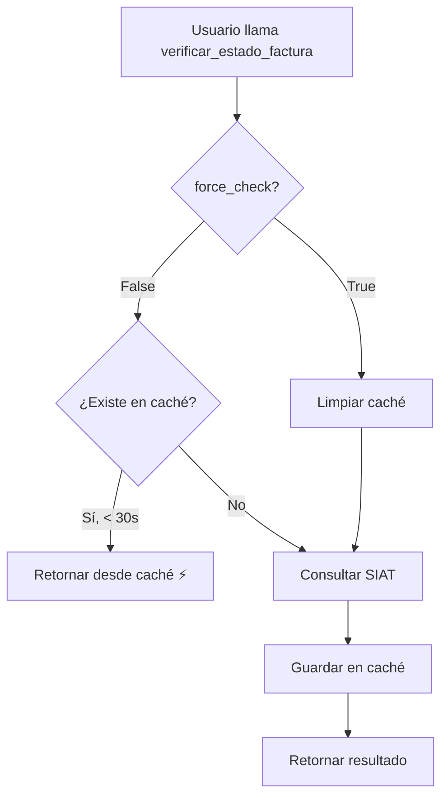

# 🚀 Guía de Uso: Sistema de Caché Híbrido Inteligente

**Versión:** 2.1.0  
**Fecha:** 15 octubre 2025  
**Módulo:** `estado_factura.py`

---

## 📋 Índice

1. [Resumen Ejecutivo](#resumen-ejecutivo)
2. [Cómo Funciona](#cómo-funciona)
3. [Guía de Uso por Escenario](#guía-de-uso-por-escenario)
4. [Ejemplos de Código](#ejemplos-de-código)
5. [Casos de Uso Específicos](#casos-de-uso-específicos)
6. [Logs y Debugging](#logs-y-debugging)
7. [Preguntas Frecuentes](#preguntas-frecuentes)

---

## 🎯 Resumen Ejecutivo

### ¿Qué cambió?

**ANTES (v2.0.0):**
```python
# Siempre usaba caché de 120 segundos
exito, msg = verificar_estado_factura(123)
```

**AHORA (v2.1.0):**
```python
# Consulta informativa: usa caché (30s)
exito, msg = verificar_estado_factura(123)

# Operación crítica: siempre consulta SIAT
exito, msg = verificar_estado_factura(123, force_check=True)
```

### ¿Por qué cambió?

| Antes | Ahora |
|-------|-------|
| Caché de 120s fijo | Caché de 30s + opción de forzar |
| Datos obsoletos hasta 2 min | Datos obsoletos máximo 30s |
| Sin control en operaciones críticas | Control total con `force_check` |
| Riesgo en anulaciones/reversiones | Seguro para operaciones críticas |

---

## 🔧 Cómo Funciona

### Arquitectura del Sistema

```
verificar_estado_factura(numero, force_check=False)
    │
    ├─── force_check=False (DEFAULT)
    │    └─→ _verificar_estado_factura_cached()
    │        ├─ Primera llamada: Consulta SIAT (~2-3s)
    │        └─ Llamadas < 30s: Caché (~10ms) ⚡
    │
    └─── force_check=True
         ├─ Limpia caché: .clear()
         └─→ _verificar_estado_factura_cached()
             └─ SIEMPRE consulta SIAT (~2-3s) 🔴
```

### Flujo de Decisión



---

## 📖 Guía de Uso por Escenario

### ✅ Escenario 1: Consulta Informativa

**Cuándo:** Usuario solo quiere "ver" el estado de una factura.

**Usar:**
```python
exito, mensaje = verificar_estado_factura(numero_factura)
```

**Comportamiento:**
- 1ra llamada: Consulta SIAT (~2-3s)
- 2da+ llamada (< 30s): Respuesta instantánea (~10ms)
- Log: `[VERIFICACIÓN] Consultando factura #123 (caché permitido, TTL=30s)`

**Ventajas:**
- ⚡ Respuesta rápida en clicks repetidos
- 🌐 Reduce carga en SIAT
- 😊 Mejor UX

---

### 🔴 Escenario 2: Anulación de Factura

**Cuándo:** Antes de anular una factura (CRÍTICO).

**Usar:**
```python
# ⚠️ SIEMPRE con force_check=True
exito, mensaje = verificar_estado_factura(numero_factura, force_check=True)

if exito and "VALIDA" in mensaje:
    # Proceder con anulación
    procesar_anulacion(numero_factura)
else:
    # Mostrar error
    st.error("La factura no está en estado válido para anular")
```

**Comportamiento:**
- SIEMPRE consulta SIAT (~2-3s)
- Ignora cualquier caché previo
- Log: `[VERIFICACIÓN FORZADA] 🔴 Ignorando caché para factura #123 - Consulta crítica al SIAT`

**Por qué es crítico:**
```python
# ❌ SIN force_check (PELIGROSO):
# 10:00:00 - Verificas factura #100 → "VALIDA" (se cachea)
# 10:00:15 - Otro usuario anula #100 en otra terminal
# 10:00:20 - Intentas anular #100 → Lee "VALIDA" del caché ❌
# 10:00:21 - Envías anulación duplicada al SIAT → ERROR 909

# ✅ CON force_check=True (SEGURO):
# 10:00:20 - Verificas con force_check → Consulta SIAT
# 10:00:22 - SIAT responde "ANULADA"
# 10:00:22 - Bloqueas la anulación duplicada ✅
```

---

### 🔄 Escenario 3: Reversión de Anulación

**Cuándo:** Antes de revertir una anulación (CRÍTICO).

**Usar:**
```python
# ⚠️ SIEMPRE con force_check=True
exito, mensaje = verificar_estado_factura(numero_factura, force_check=True)

if exito and "ANULADA" in mensaje:
    # Proceder con reversión
    procesar_reversion(numero_factura)
else:
    st.error("La factura debe estar anulada para revertir")
```

---

### 📊 Escenario 4: Listado de Facturas (Múltiples)

**Cuándo:** Mostrando una tabla con muchas facturas.

**Usar:**
```python
# Para cada factura en el listado
for numero in lista_facturas:
    # Usa caché (consultas informativas)
    exito, estado = verificar_estado_factura(numero)
    tabla.append({
        'numero': numero,
        'estado': estado
    })
```

**Ventajas:**
- Si el usuario refresca la vista, las facturas consultadas recientemente responden al instante
- Reduce carga masiva en SIAT

---

### 🔄 Escenario 5: Botón "Refrescar Estado"

**Cuándo:** Usuario quiere actualizar manualmente el estado.

**Implementación en la UI:**
```python
import streamlit as st

col1, col2 = st.columns([3, 1])

with col1:
    numero_factura = st.number_input("Número de Factura", min_value=1)

with col2:
    force_refresh = st.button("🔄 Refrescar")

if st.button("Verificar"):
    # Si presionó "Refrescar", forzar consulta
    exito, mensaje = verificar_estado_factura(
        numero_factura, 
        force_check=force_refresh  # True si presionó refrescar
    )
    
    st.info(mensaje)
```

---

## 💻 Ejemplos de Código

### Ejemplo 1: Pestaña de Verificación (Solo Consulta)

```python
# archivo: tabs/verificar_factura_tab.py

import streamlit as st
from estado_factura import verificar_estado_factura

def render():
    st.header("🔍 Verificar Estado de Factura")
    
    numero = st.number_input("Número de Factura", min_value=1)
    
    if st.button("Verificar"):
        # Consulta informativa: usa caché
        exito, mensaje = verificar_estado_factura(numero)
        
        if exito:
            st.success(mensaje)
        else:
            st.error(mensaje)
```

**Comportamiento:**
- Click 1: Consulta SIAT (~2s)
- Click 2 (en < 30s): Respuesta instantánea
- Usuario feliz con la velocidad ⚡

---

### Ejemplo 2: Anulación de Factura (Crítico)

```python
# archivo: tabs/anular_factura_tab.py

import streamlit as st
from estado_factura import verificar_estado_factura
from anulacion import anular_factura

def render():
    st.header("❌ Anular Factura")
    
    numero = st.number_input("Número de Factura", min_value=1)
    motivo = st.text_area("Motivo de Anulación")
    
    if st.button("Anular Factura"):
        # 🔴 CRÍTICO: SIEMPRE forzar verificación
        exito, mensaje = verificar_estado_factura(numero, force_check=True)
        
        if not exito:
            st.error(f"Error al verificar: {mensaje}")
            return
        
        if "VALIDA" not in mensaje.upper():
            st.error("⚠️ La factura no está en estado válido para anular")
            return
        
        # Proceder con anulación
        resultado = anular_factura(numero, motivo)
        
        if resultado:
            st.success("✅ Factura anulada exitosamente")
        else:
            st.error("❌ Error al anular factura")
```

---

### Ejemplo 3: Reversión con Validación Doble

```python
# archivo: tabs/revertir_anulacion_tab.py

import streamlit as st
from estado_factura import verificar_estado_factura
from reversion import revertir_anulacion

def render():
    st.header("🔄 Revertir Anulación")
    
    numero = st.number_input("Número de Factura", min_value=1)
    
    if st.button("Revertir Anulación"):
        with st.spinner("Verificando estado actual en SIAT..."):
            # 🔴 CRÍTICO: Verificación forzada
            exito, mensaje = verificar_estado_factura(numero, force_check=True)
        
        if not exito:
            st.error(f"Error al verificar: {mensaje}")
            return
        
        if "ANULADA" not in mensaje.upper():
            st.warning("⚠️ La factura debe estar anulada para poder revertir")
            st.info(f"Estado actual: {mensaje}")
            return
        
        # Confirmar con el usuario
        if st.checkbox("Confirmo que quiero revertir esta anulación"):
            resultado = revertir_anulacion(numero)
            
            if resultado:
                st.success("✅ Anulación revertida exitosamente")
                
                # Verificar el nuevo estado (forzado de nuevo)
                with st.spinner("Verificando nuevo estado..."):
                    _, nuevo_estado = verificar_estado_factura(numero, force_check=True)
                
                st.info(f"Nuevo estado: {nuevo_estado}")
            else:
                st.error("❌ Error al revertir anulación")
```

---

### Ejemplo 4: Dashboard con Caché Inteligente

```python
# archivo: tabs/dashboard_tab.py

import streamlit as st
from estado_factura import verificar_estado_factura
from data_access import obtener_ultimas_facturas

def render():
    st.header("📊 Dashboard de Facturas")
    
    # Botón para refrescar todo
    if st.button("🔄 Refrescar Estados"):
        st.session_state['force_refresh'] = True
    
    facturas = obtener_ultimas_facturas(limite=20)
    
    for factura in facturas:
        with st.expander(f"Factura #{factura.numeroFactura}"):
            # Usar force_check solo si el usuario presionó refrescar
            force = st.session_state.get('force_refresh', False)
            
            exito, estado = verificar_estado_factura(
                factura.numeroFactura,
                force_check=force
            )
            
            if exito:
                st.success(f"Estado: {estado}")
            else:
                st.error(f"Error: {estado}")
    
    # Resetear flag después de renderizar
    if st.session_state.get('force_refresh'):
        st.session_state['force_refresh'] = False
```

---

## 📝 Casos de Uso Específicos

### Caso 1: Cliente Llama para Verificar una Factura

```python
# Escenario: Atención al cliente, consulta telefónica

# Cliente: "¿Qué estado tiene mi factura 1234?"
# Operador: Ingresa 1234 y presiona "Verificar"

exito, mensaje = verificar_estado_factura(1234)  # Usa caché (rápido)

# Cliente: "Ah, me equivoqué, es la 1235"
# Operador: Ingresa 1235 y presiona "Verificar"

exito, mensaje = verificar_estado_factura(1235)  # Consulta SIAT (nueva)

# Cliente: "Espera, me confundí, vuelve a ver la 1234"
# Operador: Ingresa 1234 nuevamente

exito, mensaje = verificar_estado_factura(1234)  # ⚡ Caché (instantáneo)
```

**Resultado:** Atención más ágil, cliente satisfecho.

---

### Caso 2: Auditoría Requiere Estados Actuales

```python
# Escenario: Auditor necesita estados precisos de 50 facturas

auditor_mode = st.checkbox("Modo Auditoría (sin caché)")

resultados = []
for numero in lista_facturas_auditoria:
    exito, estado = verificar_estado_factura(
        numero,
        force_check=auditor_mode  # Forzar si está en modo auditoría
    )
    resultados.append({
        'factura': numero,
        'estado': estado,
        'timestamp': datetime.now()
    })

# Exportar a Excel
df = pd.DataFrame(resultados)
st.download_button("📥 Descargar Reporte", df.to_csv())
```

---

### Caso 3: Proceso Batch Nocturno

```python
# Escenario: Script que verifica 1000 facturas cada noche

import logging
from estado_factura import verificar_estado_factura

def proceso_batch_verificacion():
    """
    Proceso nocturno: No necesita velocidad, necesita precisión.
    """
    facturas = obtener_facturas_pendientes()
    
    for factura in facturas:
        # SIEMPRE forzar en procesos batch (datos precisos)
        exito, estado = verificar_estado_factura(
            factura.numeroFactura,
            force_check=True  # 🔴 Precisión sobre velocidad
        )
        
        if exito:
            actualizar_registro_auditoria(factura, estado)
            logging.info(f"Factura #{factura.numeroFactura}: {estado}")
        else:
            logging.error(f"Error en factura #{factura.numeroFactura}: {estado}")
        
        # Delay para no sobrecargar SIAT
        time.sleep(0.5)
```

---

## 🔍 Logs y Debugging

### Tipos de Logs

#### 1. Consulta con Caché Permitido (Normal)
```
[VERIFICACIÓN] Consultando factura #123 (caché permitido, TTL=30s)
```

#### 2. Consulta Forzada (Crítica)
```
[VERIFICACIÓN FORZADA] 🔴 Ignorando caché para factura #123 - Consulta crítica al SIAT
```

#### 3. Ejecución Real de Consulta
```
[VERIFICACIÓN] Ejecutando consulta REAL al SIAT para factura #123 (CUF: 178B43EFDB9D6D2F...)
```

### Interpretación de Logs

```bash
# Ejemplo de secuencia de logs:

# 1. Primera consulta (caché permitido)
10:00:00 [VERIFICACIÓN] Consultando factura #100 (caché permitido, TTL=30s)
10:00:00 [VERIFICACIÓN] Ejecutando consulta REAL al SIAT para factura #100...
10:00:02 [SIAT Client] ✅ Respuesta recibida con éxito (200 OK)

# 2. Segunda consulta (desde caché)
10:00:15 [VERIFICACIÓN] Consultando factura #100 (caché permitido, TTL=30s)
# ⚠️ NOTA: No aparece "Ejecutando consulta REAL" = vino del caché

# 3. Consulta forzada (operación crítica)
10:00:30 [VERIFICACIÓN FORZADA] 🔴 Ignorando caché para factura #100...
10:00:30 [VERIFICACIÓN] Ejecutando consulta REAL al SIAT para factura #100...
10:00:32 [SIAT Client] ✅ Respuesta recibida con éxito (200 OK)
```

### Debugging con Streamlit

```python
# Añadir panel de debug en desarrollo
if st.secrets.get("DEBUG_MODE", False):
    st.sidebar.title("🐛 Debug Info")
    
    # Mostrar estado del caché
    st.sidebar.write("**Caché Info:**")
    st.sidebar.json({
        "TTL": "30 segundos",
        "Función cacheada": "_verificar_estado_factura_cached",
        "Última limpieza": st.session_state.get("last_cache_clear", "Nunca")
    })
    
    # Botón para limpiar caché manualmente
    if st.sidebar.button("🗑️ Limpiar Caché Manualmente"):
        from estado_factura import _verificar_estado_factura_cached
        _verificar_estado_factura_cached.clear()
        st.session_state["last_cache_clear"] = datetime.now()
        st.sidebar.success("Caché limpiado")
```

---

## ❓ Preguntas Frecuentes

### P1: ¿Qué pasa si no pongo `force_check`?
**R:** Por defecto es `False`, usará caché (30s). Perfecto para consultas informativas.

### P2: ¿Siempre debo usar `force_check=True` en anulaciones?
**R:** **SÍ, ABSOLUTAMENTE**. De lo contrario arriesgas decisiones basadas en datos obsoletos.

### P3: ¿El caché es por usuario o global?
**R:** Es por sesión de Streamlit (`st.cache_data`). Cada usuario tiene su propio caché.

### P4: ¿Puedo cambiar el TTL de 30 segundos?
**R:** Sí, editando el decorador `@st.cache_data(ttl=30)` en `estado_factura.py`.

**Recomendaciones:**
- `ttl=10`: Ultra-actualizado (más carga en SIAT)
- `ttl=30`: **Balance óptimo** ✅ (recomendado)
- `ttl=60`: Más caché, menos actualizado
- `ttl=120`: Riesgoso para operaciones críticas ⚠️

### P5: ¿Cómo sé si una consulta vino del caché?
**R:** Revisa los logs:
- Con caché: Solo ves `[VERIFICACIÓN] Consultando...`
- Sin caché: Ves `[VERIFICACIÓN] Ejecutando consulta REAL...`

### P6: ¿Qué pasa si el SIAT está caído?
**R:** El caché mantiene la última respuesta exitosa (hasta 30s), mejorando disponibilidad.

### P7: ¿Puedo deshabilitar el caché completamente?
**R:** Sí, cambia todas las llamadas a `force_check=True`, pero perderás performance.

---

## 📚 Referencias

- **Documentación del módulo:** `estado_factura.py` (líneas 1-30)
- **Implementación técnica:** `estado_factura.py` (líneas 138-232)
- **Cliente SIAT centralizado:** `siat_service_client.py`

---

## ✅ Checklist de Migración

Si tienes código existente que usa `verificar_estado_factura()`:

- [ ] Identificar todas las llamadas a `verificar_estado_factura()`
- [ ] Clasificar cada llamada:
  - [ ] ¿Es consulta informativa? → Dejar sin `force_check`
  - [ ] ¿Es operación crítica? → Agregar `force_check=True`
- [ ] Actualizar código de anulación con `force_check=True`
- [ ] Actualizar código de reversión con `force_check=True`
- [ ] Probar en ambiente de desarrollo
- [ ] Monitorear logs para verificar comportamiento
- [ ] Desplegar a producción

---

## 🎯 Resumen Final

| Situación | Usar | Motivo |
|-----------|------|--------|
| Ver estado de factura | `verificar_estado_factura(num)` | Velocidad ⚡ |
| Anular factura | `verificar_estado_factura(num, force_check=True)` | Precisión 🎯 |
| Revertir anulación | `verificar_estado_factura(num, force_check=True)` | Precisión 🎯 |
| Dashboard informativo | `verificar_estado_factura(num)` | Performance 🚀 |
| Proceso batch/auditoría | `verificar_estado_factura(num, force_check=True)` | Exactitud 📊 |
| Usuario presiona "Refrescar" | `verificar_estado_factura(num, force_check=True)` | UX 😊 |

**Regla de oro:** Si la decisión afecta datos (CREATE, UPDATE, DELETE), usa `force_check=True`.

---

**Versión del documento:** 1.0  
**Última actualización:** 15 octubre 2025  
**Autor:** Sistema de Facturación Electrónica
