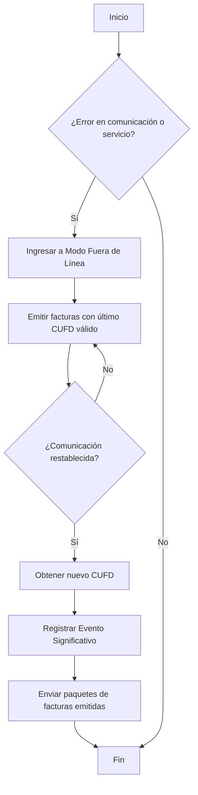

## Contingencia y Eventos Significativos

Los eventos significativos son hechos inherentes al Sistema informático de Facturación que intervienen en su funcionamiento o que podrían afectar la emisión de las Facturas. 
Deben ser registrados hasta 48 horas posteriores de finalizada (superada) la contingencia sonsumiendo el servicio Web correspondiente.

## Tipos de Eventos Significativos que generan contingencia

+----------------------------------------------------------------------+-----------------------------------------------------------------------------------------------------------------------------------------------------------------------------------------------------------------------------------------------------------------------------------------------------------------------------------------------------------------------------------+
|                                                                      |                                                                                                                                                                                                                                                                                                                                                                                   |
| EVENTO SIGNIFICATIVO                                                 | DETALLE DE ACCIÓN A REALIZAR                                                                                                                                                                                                                                                                                                                                                               |
+----------------------------------------------------------------------+-----------------------------------------------------------------------------------------------------------------------------------------------------------------------------------------------------------------------------------------------------------------------------------------------------------------------------------------------------------------------------------+
|                                                                      |                                                                                                                                                                                                                                                                                                                                                                                   |
|                                                                      |                                                                                                                                                                                                                                                                                                                                                                                   |
| 1) Corte del servicio de Internet                                    |                                                                                                                                                                                                                                                                                                                                                                                   |
|                                                                      |                                                                                                                                                                                                                                                                                                                                                                                   |
|                                                                      |                                                                                                                                                                                                                                                                                                                                                                                   |
+----------------------------------------------------------------------+                                                                                                                                                                                                                                                                                                                                                                                   |
|                                                                      |                                                                                                                                                                                                                                                                                                                                                                                   |
|                                                                      | Emitir Documentos Fiscales digitales fuera de línea                                                                                                                                                                                                                                                                                                                               |
| 2) Inaccesibilidad al Servicio Web de la Administración Tributaria.  |                                                                                                                                                                                                                                                                                                                                                                                   |
|                                                                      |                                                                                                                                                                                                                                                                                                                                                                                   |
+----------------------------------------------------------------------+                                                                                                                                                                                                                                                                                                                                                                                   |
|                                                                      |                                                                                                                                                                                                                                                                                                                                                                                   |
|                                                                      |                                                                                                                                                                                                                                                                                                                                                                                   |
| 3) Ingreso a zonas sin Internet por despliegue de puntos de venta.   |                                                                                                                                                                                                                                                                                                                                                                                   |
|                                                                      |                                                                                                                                                                                                                                                                                                                                                                                   |
+----------------------------------------------------------------------+                                                                                                                                                                                                                                                                                                                                                                                   |
|                                                                      |                                                                                                                                                                                                                                                                                                                                                                                   |
|                                                                      |                                                                                                                                                                                                                                                                                                                                                                                   |
| 4) Venta en Lugares sin internet.                                    |                                                                                                                                                                                                                                                                                                                                                                                   |
|                                                                      |                                                                                                                                                                                                                                                                                                                                                                                   |
+----------------------------------------------------------------------+-----------------------------------------------------------------------------------------------------------------------------------------------------------------------------------------------------------------------------------------------------------------------------------------------------------------------------------------------------------------------------------+
|                                                                      |                                                                                                                                                                                                                                                                                                                                                                                   |
| 5) Virus informático o falla de software.                            | Emitir  Facturas por Contingencia autorizadas por la Administración Tributaria,  solicitadas con anterioridad por el Sujeto Pasivo del IVA o emitir  Documentos Fiscales Digitales usando de manera transitoria y por contingencia la Modalidad de Facturación Portal Web en línea.                                                                                               |
|                                                                      |                                                                                                                                                                                                                                                                                                                                                                                   |
+----------------------------------------------------------------------+                                                                                                                                                                                                                                                                                                                                                                                   |
|                                                                      |                                                                                                                                                                                                                                                                                                                                                                                   |
| 6) Cambio de infraestructura de sistema o falla de hardware.         |                                                                                                                                                                                                                                                                                                                                                                                   |
+----------------------------------------------------------------------+-----------------------------------------------------------------------------------------------------------------------------------------------------------------------------------------------------------------------------------------------------------------------------------------------------------------------------------------------------------------------------------+
|                                                                      | Emitir  Facturas por Contingencia autorizadas por la Administración Tributaria,  solicitadas con anterioridad por el Sujeto Pasivo del IVA.                                                                                                                                                                                                                                       |
| 7) Corte de suministro de energía eléctrica.                         |                                                                                                                                                                                                                                                                                                                                                                                   |
+----------------------------------------------------------------------+-----------------------------------------------------------------------------------------------------------------------------------------------------------------------------------------------------------------------------------------------------------------------------------------------------------------------------------------------------------------------------------+

De producirse una contingencia, pero el sistema informático continua operativo, este deberá cambiar a la emisión de facturas fuera de línea, las facturas se emiten con el CUFD vigente hasta antes del corte. Las facturas emitidas se almacenan en paquetes que posteriormente serán enviados a la administración Tributaria, cuando la contingencia se haya superado. 
En caso de que no pueda utilizarse el sistema informático por falla de hardware, software o por corte de energía eléctrica, se deberán emitir facturas manuales de contingencia previamente aprovisionadas, superada la contingencia estas deberán ser transcritas utilizando para ello el CUFD que estaba vigente al ingresar en contingencia y enviadas a la Administración Tributaria a través del mismo sistema informático de facturación. 
(Obtener un nuevo CUFD antes de registrar el evento significativo y enviar los paquetes, a fin de evitar posibles inconvenientes relacionados al tiempo de vigencia del CUFD durante el envío de los mismos de no hacerlo).
Nota: Como buena práctica, debe mantenerse un registro de facturas sin código de respuesta, a objeto de que una vez superada la contingencia las mismas se verifiquen consumiendo el servicio verificaciónEstadoFactura a objeto de identificar si tienen registro o no en el Servicio de Impuestos Nacionales y proceder a su anulación en caso de ser necesario.

## Condiciones para Ingresar a Contingencia (Fuera de Línea)

Se debe ingresar a **Modo Fuera de Línea** cuando:

- Al consumir el **servicio de verificación de comunicación** se reciben respuestas como:
  - `Time Out`
  - `-1`
  - `Java Null Point`
  - `HTTP 500`
- Si después de **varios intentos** persiste el error.
- También aplica si el error ocurre durante el consumo de otros servicios (`400`, `404`, `Time Out`).

**Recomendación:**  
Mantenerse en modo **Fuera de Línea** por un tiempo prudencial (máximo **2 horas**, dependiendo de las características del negocio).  

---

## Procedimiento General

1. **Ingresar a Fuera de Línea.**
2. **Emitir facturas localmente** con el último **CUFD válido**.
3. Una vez restablecida la comunicación:
   - Obtener un nuevo **CUFD**.
   - **Registrar el evento significativo**.
   - **Enviar los paquetes** de facturas emitidas durante la contingencia.

---

## Escenarios Específicos

### 1. Emisión de Facturas
- Si ocurre un error (`Time Out`, `-1`, `Java Null Point`, `HTTP 500`) durante la emisión:
  - Recuperada la comunicación:
    1. Obtener nuevo **CUFD**.
    2. Verificar el estado de la factura en el SIN.
       - Si está **registrada**, proceder con **anulación**.
       - Luego, **registrar evento significativo** y **enviar paquetes**.

---

### 2. Anulación de Facturas
- Si ocurre error al **anular una factura**:
  - Esperar un tiempo prudencial y reintentar.
  - Antes de reintentar, **verificar estado de la factura** en el SIN:
    - Si ya aparece **anulada**, completar la anulación **localmente**.
    - Si sigue **válida**, proceder nuevamente con la anulación.

---

### 3. Solicitud de CUFD
- Si ocurre error (`Time Out`, `-1`, `Java Null Point`, `HTTP 500`):
  - Ingresar a **Fuera de Línea**.
  - Emitir facturas con el **último CUFD válido**.
  - En este caso, el CUFD puede extender su validez hasta **72 horas**.
  - Recuperada la comunicación:
    1. Obtener nuevo **CUFD**.
    2. **Registrar evento significativo**.
    3. **Enviar paquetes** emitidos.

---

## Buenas Prácticas

- No permanecer en **Fuera de Línea** más de **2 horas** seguidas.
- Documentar siempre el **evento significativo** en el sistema interno.
- Automatizar el reintento de conexión para reducir errores humanos.
- Mantener un **log detallado** de:
  - Facturas emitidas en contingencia.
  - Eventos significativos registrados.
  - Fechas y horas de recuperación de comunicación.

---

## Diagrama de Flujo

---

## Resumen Visual

1. Detectar error recurrente (Timeout, 500, etc.)  
2. Ingresar a **Fuera de Línea**  
3. Emitir facturas con **último CUFD válido**  
4. Recuperada comunicación:  
   - Obtener nuevo **CUFD**  
   - Registrar **evento significativo**  
   - Enviar **paquetes**  

---

## Emisión y envío de Paquetes por Fuera de Linea

Se recurre a la emisión de Facturas fuera de línea (OFFLINE), cuando sucede algún evento significativos que impida la emisión de documentos fiscales en línea. En este caso las facturas se emiten individualmente y se agrupan en paquetes de hasta 500 documentos fiscales, para que luego de superada la contingencia se envíen los mismos a la Administración Tributaria a través de los servicios web correspondientes. El procedimiento a seguir es el siguiente:

Primera Etapa (Mientras dure la contingencia, proceder a emitir las facturas de manera individual)

    Registar internamente el inicio del evento, junto con el motivo, para posteriormente
    Generar Archivo XML asociado al Documento Fiscal, de acuerdo a su actividad económica (utilizar modalidad fuera de linea).
    Firmar el archivo obtenido conforme estándar XMLDSig (sólo en el caso de la Modalidad Electrónica en Línea).
    Validar contra el XSD asociado a objeto de comprobar que el XML está bien formado y se ajusta a una estructura definida.
    Almacenar temporalmente de manera individual las Facturas generadas.

Segunda Etapa (una vez superada la contingencia)

    Recuperar las Facturas almacenadas en formato XML durante la etapa anterior.
    Formar paquetes de hasta 500 Facturas.
    Comprimir con Gzip, el archivo resultante debe ser enviado utilizando para ello la etiqueta archivo.
    Obtener el HASH (SHA256) del archivo compreso obtenido en el paso anterior, mismo que debe ser enviado en la etiqueta hashArchivo.
    
	Envío de Paquetes de Facturas:

    Consumir el servicio correspondiente para obtener un nuevo CUFD.
    Registrar el evento significativo a través del servicio "Registro de Evento Significativo", indicando la fecha de inicio y fin del evento, así como el CUFD que fue usado para la emisión de facturas de contingencia.
    Enviar los paquetes consumiendo el servicio "Recepción Paquete Facturas Electrónicas". Si la transacción es exitosa, se devolverá el estado 901 (pendiente), el código de recepción del mismo y la transacción en True.
    Validar la recepción consumiendo el servicio de "Validación Recepción Paquete Facturas", mismo que devolverá el código de estado que puede ser 901 (pendiente), 904 (observada) o 908 (validado). En el caso de que existan observaciones se incluirá una lista de mensajes con códigos, descripciones, número de archivo y número de detalle de los errores y/o advertencias detectados en cada una de las facturas.

Nota: Como buena practica, debe mantenerse un registro de facturas sin código de respuesta, una vez superada la contingencia las mismas se verifiquen consumiendo el servicio verificaciónEstadoFactura a objeto de identificar si tienen registro o no en el Servicio de Impuestos Nacionales y proceder a su anulación en caso de ser necesario.

## Solicitud del Código Único de Facturación Diaria - CUFD

A continuación se describen los parámetros de entrada y salida relacionados con el CUFD:

+-------------------+-----------------------------------------------------------------------------------------------------------------------------------------------------------------------------------------------------+
|                   |                                                                                                                                                                                                     |
| Nombre Método     | solicitudCufd                                                                                                                                                                                       |
+===================+===============+==============+========================================================================================================================+====================+========================+
|                   |               |              |                                                                                                                        |                    |                        |
| Entrada           | Tipo Dato     | Obligatorio  | Descripción                                                                                                            | Salida             | Tipo Dato              |
+-------------------+---------------+--------------+------------------------------------------------------------------------------------------------------------------------+--------------------+------------------------+
|                   |               |              |                                                                                                                        |                    |                        |
|                   |               |              | Describe el tipo de ambiente utilizado, los valores permitidos son:                                                    |                    |                        |
|                   |               |              |                                                                                                                        |                    |                        |
| codigoAmbiente    | Numérico      | Si           |         Producción: 1                                                                                                  | codigoCUFD         | Alfanumérico           |
|                   |               |              |                                                                                                                        |                    |                        |
|                   |               |              |         Pruebas y Piloto: 2                                                                                            |                    |                        |
+-------------------+---------------+--------------+------------------------------------------------------------------------------------------------------------------------+--------------------+------------------------+
|                   |               |              |                                                                                                                        |                    |                        |
| codigoSistema     | Alfanumérico  | Si           | Código de Sistema que le fue asignado al momento de realizar la solicitud de autorización.                             | fechaVigencia      | Fecha UTC Extendida    |
+-------------------+---------------+--------------+------------------------------------------------------------------------------------------------------------------------+--------------------+------------------------+
|                   |               |              |                                                                                                                        |                    |                        |
| nit               | Numérico      | Si           | NIT perteneciente al emisor de la factura.                                                                             | transaccion        | Boolean                |
+-------------------+---------------+--------------+------------------------------------------------------------------------------------------------------------------------+--------------------+------------------------+
|                   |               |              |                                                                                                                        |                    |                        |
|                   |               |              | Modalidad utilizada por el Sistema Informático de Facturación para la emisión de facturas, pudiendo ser:               |                    |                        |
|                   |               |              |                                                                                                                        |                    |                        |
| codigoModalidad   | Numérico      | Si           |        Electrónica en Línea: 1                                                                                         | codigosRespuestas  | DTO[codigosRespuesta]  |
|                   |               |              |                                                                                                                        |                    |                        |
|                   |               |              |      Computarizada en Línea: 2                                                                                         |                    |                        |
+-------------------+---------------+--------------+------------------------------------------------------------------------------------------------------------------------+--------------------+------------------------+
|                   |               |              |                                                                                                                        | codigoControl      | Alfanumérico           |
| cuis              | Alfanumérico  | Si           | Valor único para una sucursal y/o punto de venta que se obtiene al realizar el inicio de uso de sistemas.              |                    |                        |
+-------------------+---------------+--------------+------------------------------------------------------------------------------------------------------------------------+--------------------+------------------------+
|                   |               |              |                                                                                                                        |  direccion         | Alfanumérico           |
|                   |               |              | Valor que identifica la sucursal donde se realiza la emisión de la Factura:                                            |                    |                        |
|                   |               |              |                                                                                                                        |                    |                        |
| codigoSucursal    | Numérico      | Si           |         Casa Matriz: 0                                                                                                 |                    |                        |
|                   |               |              |                                                                                                                        |                    |                        |
|                   |               |              |         Sucursal: 1,2,..,n                                                                                             |                    |                        |
+-------------------+---------------+--------------+------------------------------------------------------------------------------------------------------------------------+--------------------+------------------------+
|                   |               |              |                                                                                                                        |                    |                        |
| codigoPuntoVenta  | Numérico      | No           | Solo se envía este valor cuando se desea obtener un CUFD para el punto de venta (1, 2,..,n). Caso contrario enviar 0.  |                    |                        |
+-------------------+---------------+--------------+------------------------------------------------------------------------------------------------------------------------+--------------------+------------------------+

## Registro de Evento Significativo
El proceso de registro de evento significativo permite informar al SIN de la contingencia del Sistema Informático de Facturación autorizado.
El servicio implementado posee un objeto denominado SolicitudEventoSignificativo el cual contiene la información descrita en el siguiente cuadro:

+--------------------+-------------------------------------------------------------------------------------------------------------------------------------------------------------------------------+
|                    |                                                                                                                                                                               |
| Nombre Método      | registroEventoSignificativo                                                                                                                                                   |
+--------------------+---------------+--------------+------------------------------------------------------------------------------------------------------------+-------------------+---------------+
|                    |               |              |                                                                                                            |                   |               |
| Entrada            | Tipo Dato     | Obligatorio  | Descripción                                                                                                | Salida            | Tipo Dato     |
+--------------------+---------------+--------------+------------------------------------------------------------------------------------------------------------+-------------------+---------------+
|                    |               |              |                                                                                                            |                   |               |
|                    |               |              | Describe el tipo de ambiente utilizado, los valores permitidos son:                                        |                   |               |
|                    |               |              |                                                                                                            |                   |               |
| codigoAmbiente     | Numérico      | Si           | Producción: 1                                                                                              | codigoRecepcion   | Alfanumérico  |
|                    |               |              |                                                                                                            |                   |               |
|                    |               |              | Pruebas y Piloto: 2                                                                                        |                   |               |
+--------------------+---------------+--------------+------------------------------------------------------------------------------------------------------------+-------------------+---------------+
|                    |               |              |                                                                                                            |                   |               |
| codigoSistema      | Alfanumérico  | Si           | Código de Sistema que le fue asignado al momento de realizar la solicitud de autorización.                 | transaccion       | Boolean       |
+--------------------+---------------+--------------+------------------------------------------------------------------------------------------------------------+-------------------+---------------+
|                    |               |              |                                                                                                            |                   |               |
| nit                | Numérico      | Si           | NIT perteneciente al emisor de la Factura.                                                                 | mensajes          | Lista         |
+--------------------+---------------+--------------+------------------------------------------------------------------------------------------------------------+-------------------+---------------+
|                    |               |              |                                                                                                            |                   |               |
| cuis               | Alfanumérico  | Si           | Valor único para una sucursal y/o punto de venta que se obtiene al realizar el inicio de uso de sistemas.  |                   |               |
+--------------------+---------------+--------------+------------------------------------------------------------------------------------------------------------+-------------------+---------------+
|                    |               |              |                                                                                                            |                   |               |
| cufd               | Alfanumérico  |              | Valor diario otorgado por el SIN.                                                                          |                   |               |
+--------------------+---------------+--------------+------------------------------------------------------------------------------------------------------------+-------------------+---------------+
|                    |               |              |                                                                                                            |                   |               |
|                    |               |              | Valor que identifica a la sucursal donde se realiza la emisión de la Factura:                              |                   |               |
|                    |               |              |                                                                                                            |                   |               |
| codigoSucursal     | Numérico      | No           | Casa Matriz: 0                                                                                             |                   |               |
|                    |               |              |                                                                                                            |                   |               |
|                    |               |              | Sucursal: 1,2,..,n                                                                                         |                   |               |
+--------------------+---------------+--------------+------------------------------------------------------------------------------------------------------------+-------------------+---------------+
|                    |               |              |                                                                                                            |                   |               |
| codigoPuntoVenta   | Numérico      | No           | Solo se envía cuando la transacción se realiza utilizando un punto de venta. Caso contrario enviar 0.      |                   |               |
+--------------------+---------------+--------------+------------------------------------------------------------------------------------------------------------+-------------------+---------------+
|                    |               |              |                                                                                                            |                   |               |
| codigoEvento       | Numérico      | Si           | Paramétrica que identifica el tipo de evento.                                                              |                   |               |
+--------------------+---------------+--------------+------------------------------------------------------------------------------------------------------------+-------------------+---------------+
|                    |               |              |                                                                                                            |                   |               |
| descripcion        | Alfanumérico  | Si           | Descripción del evento significativo.                                                                      |                   |               |
+--------------------+---------------+--------------+------------------------------------------------------------------------------------------------------------+-------------------+---------------+
|                    |               |              |                                                                                                            |                   |               |
| fechaInicioEvento  | String        | Si           | El formato que debe tener es:"yyyy-MM-dd'T'HH:mm:ss.SSS"                                                   |                   |               |
+--------------------+---------------+--------------+------------------------------------------------------------------------------------------------------------+-------------------+---------------+
|                    |               |              |                                                                                                            |                   |               |
| fechaFinEvento     | String        | Si           | El formato que debe tener es:"yyyy-MM-dd'T'HH:mm:ss.SSS"                                                   |                   |               |
+--------------------+---------------+--------------+------------------------------------------------------------------------------------------------------------+-------------------+---------------+
|                    |               |              |                                                                                                            |                   |               |
| cufdEvento         | Alfanumérico  | Si           | Valor del CUFD que se uso en la contingencia.                                                              |                   |               |
+--------------------+---------------+--------------+------------------------------------------------------------------------------------------------------------+-------------------+---------------+

## Recepción Paquete Facturas Electrónicas
Está compuesta por una serie de Servicios Web habilitados para recibir paquetes de hasta 500 facturas. Dichos servicios reciben el paquete verificando que los parámetros enviados sean válidos, analizan si el paquete recibido es correcto.
Si el paquete recibido supera esta etapa, el servicio devuelve el código de recepción. Caso contrario, se devuelve los código de error o advertencia.
El servicio implementado posee un objeto denominado SolicitudServicioRecepcionPaquete el cual contiene la información descrita en el siguiente cuadro:

+---------------------------------------------------------------------------------------------------------------------------------------------------------------------------------------------------------------+
| Nombre Método: RecepcionPaqueteFactura                                                                                                                                                                        |
+------------------------+------------+--------------+------------------------------------------------------------------------------------------------------------+--------------------+------------------------+
|                        |            |              |                                                                                                            |                    |                        |
| Entrada                | Tipo Dato  | Obligatorio  | Descripción                                                                                                | Salida             | Tipo Dato              |
+------------------------+------------+----+---------+------------------------------------------------------------------------------------------------------------+--------------------+------------------------+
|                        |                 |         |                                                                                                            |                    |                        |
| codigoAmbiente         | Numérico        | Si      | Describe el tipo de ambiente utilizado, los valores permitidos son:                                        | codigoEstado       |                        |
|                        |                 |         |                                                                                                            |                    |                        |
|                        |                 |         |         Producción: 1                                                                                      |                    | Numérico               |
|                        |                 |         |                                                                                                            |                    |                        |
|                        |                 |         |         Pruebas y Piloto: 2                                                                                |                    |                        |
+------------------------+-----------------+---------+------------------------------------------------------------------------------------------------------------+--------------------+------------------------+
|                        |                 |         |                                                                                                            |  codigoRecepcion   |  Alfanumérico          |
| codigoPuntoVenta       | Numérico        | No      | Solo se envía cuando la transacción se realiza utilizando un punto de venta. Caso contrario enviar 0.      |                    |                        |
+------------------------+-----------------+---------+------------------------------------------------------------------------------------------------------------+--------------------+------------------------+
|                        |                 |         |                                                                                                            |                    |                        |
| codigoSistema          | Alfanumérico    | Si      | Código de Sistema que le fue asignado al momento de realizar la solicitud de autorización.                 | CodigosRespuestas  | DTO[codigosRespuesta]  |
+------------------------+-----------------+---------+------------------------------------------------------------------------------------------------------------+--------------------+------------------------+
|                        |                 |         |                                                                                                            |                    |                        |
| codigoSucursal         | Numérico        | Si      | Valor que identifica a la sucursal donde se realiza la emisión de la Factura:                              | transaccion        |                        |
|                        |                 |         |                                                                                                            |                    |                        |
|                        |                 |         |         Casa Matriz: 0                                                                                     |                    | Boolean                |
|                        |                 |         |                                                                                                            |                    |                        |
|                        |                 |         |         Sucursal: 1,2,...,n                                                                                |                    |                        |
+------------------------+-----------------+---------+------------------------------------------------------------------------------------------------------------+--------------------+------------------------+
|                        |                 |         |                                                                                                            |  codigoDescripcion | Alfanumérico           |
| nit                    | Numérico        | Si      | NIT perteneciente al emisor de la Factura.                                                                 |                    |                        |
+------------------------+-----------------+---------+------------------------------------------------------------------------------------------------------------+--------------------+------------------------+
|                        |                 |         |                                                                                                            |                    |                        |
| codigoDocumentoSector  | Numérico        | Si      | Código que identifica el sector de la  Factura.                                                            |                    |                        |
+------------------------+-----------------+---------+------------------------------------------------------------------------------------------------------------+--------------------+------------------------+
|                        |                 |         |                                                                                                            |                    |                        |
| codigoEmision          | Numérico        | Si      | Describe si la emisión se realizó fuera de línea. El valor permitido es:                                   |                    |                        |
|                        |                 |         |                                                                                                            |                    |                        |
|                        |                 |         |         Offline : 2                                                                                        |                    |                        |
+------------------------+-----------------+---------+------------------------------------------------------------------------------------------------------------+--------------------+------------------------+
|                        |                 |         |                                                                                                            |                    |                        |
| codigoModalidad        | Numérico        | Si      | Electrónica en Línea: 1                                                                                    |                    |                        |
+------------------------+-----------------+---------+------------------------------------------------------------------------------------------------------------+--------------------+------------------------+
|                        |                 |         |                                                                                                            |                    |                        |
| cufd                   | Alfanumérico    | Si      | Valor diario otorgado por el SIN.                                                                          |                    |                        |
+------------------------+-----------------+---------+------------------------------------------------------------------------------------------------------------+--------------------+------------------------+
|                        |                 |         |                                                                                                            |                    |                        |
| cuis                   | Alfanumérico    | Si      | Valor único para una sucursal y/o punto de venta que se obtiene al realizar el inicio de uso de sistemas.  |                    |                        |
+------------------------+-----------------+---------+------------------------------------------------------------------------------------------------------------+--------------------+------------------------+
|                        |                 |         |                                                                                                            |                    |                        |
| tipoFacturaDocumento   | Numérico        | Si      | Código que identifica el Tipo de Factura o Documento de Ajuste que se está enviando.                       |                    |                        |
+------------------------+-----------------+---------+------------------------------------------------------------------------------------------------------------+--------------------+------------------------+
|                        |                 |         |                                                                                                            |                    |                        |
| archivo                | Alfanumérico    | Si      | Paquete de Facturas que son enviadas para su validación.                                                   |                    |                        |
+------------------------+-----------------+---------+------------------------------------------------------------------------------------------------------------+--------------------+------------------------+
|                        |                 |         |                                                                                                            |                    |                        |
| fechaEnvio             | TimeStamp       | Si      | Fecha y hora en la cual se envía la Factura.                                                               |                    |                        |
+------------------------+-----------------+---------+------------------------------------------------------------------------------------------------------------+--------------------+------------------------+
|                        |                 |         |                                                                                                            |                    |                        |
| hashArchivo            | Alfanumérico    | Si      | Sha256 de la cadena Archivo que se envía.                                                                  |                    |                        |
+------------------------+-----------------+---------+------------------------------------------------------------------------------------------------------------+--------------------+------------------------+
|                        |                 |         |                                                                                                            |                    |                        |
| cafc                   | Alfanumérico    | No      | Código de autorización de emisión de facturas manuales de contingencia. Nulo si son facturas normales      |                    |                        |
+------------------------+-----------------+---------+------------------------------------------------------------------------------------------------------------+--------------------+------------------------+
|                        |                 |         |                                                                                                            |                    |                        |
| cantidadFacturas       | Numérico        | Si      | Cantidad de Facturas enviadas en el paquete.                                                               |                    |                        |
+------------------------+-----------------+---------+------------------------------------------------------------------------------------------------------------+--------------------+------------------------+
|                        |                 |         |                                                                                                            |                    |                        |
| codigoEvento           | Numérico        | Si      | Código que devolvió el método de registro de evento.                                                       |                    |                        |
+------------------------+-----------------+---------+------------------------------------------------------------------------------------------------------------+--------------------+------------------------+

## Validación Recepción Paquete Facturas
Está compuesta por una serie de Servicios Web habilitados para verificar el estado de los paquetes de facturas emitidos y enviadas al SIN.
Dichos servicios previa validación de los parámetros enviados, verifican el estado en el cual se encuentra los paquetes de facturas. Si todas las facturas pasaron las validaciones y no se encontraron errores se devuelve un código de aceptación, caso contrario se devuelve un codigo de rechazo junto a una lista con el detalle de aquellas Facturas con problemas y los errores o advertencias detectados en cada uno de ellos.
El servicio implementado posee un objeto denominado SolicitudServicioValidacionRecepcionPaquete el cual contiene la información descrita en el siguiente cuadro:

+----------------------------------------------------------------------------------------------------------------------------------------------------------------------------------------------------------------+
| Nombre Método: validacionRecepcionPaqueteFactura                                                                                                                                                               |
+------------------------+------------+--------------+-------------------------------------------------------------------------------------------------------------+--------------------+------------------------+
|                        |            |              |                                                                                                             |                    |                        |
| Entrada                | Tipo Dato  | Obligatorio  | Descripción                                                                                                 | Salida             | Tipo Dato              |
+------------------------+------------+----+---------+-------------------------------------------------------------------------------------------------------------+--------------------+------------------------+
|                        |                 |         |                                                                                                             |                    |                        |
| codigoAmbiente         | Numérico        | Si      | Describe el tipo de ambiente utilizado, los valores permitidos son:                                         | codigoEstado       |                        |
|                        |                 |         |                                                                                                             |                    |                        |
|                        |                 |         |      Producción: 1                                                                                          |                    | Numérico               |
|                        |                 |         |                                                                                                             |                    |                        |
|                        |                 |         |      Pruebas y Piloto: 2                                                                                    |                    |                        |
+------------------------+-----------------+---------+-------------------------------------------------------------------------------------------------------------+--------------------+------------------------+
|                        |                 |         |                                                                                                             |  codigoDescripcion |  Alfanumérico          |
| codigoPuntoVenta       | Numérico        | No      | Solo se envía cuando la transacción se realiza utilizando un punto de venta. Caso contrario enviar 0.       |                    |                        |
+------------------------+-----------------+---------+-------------------------------------------------------------------------------------------------------------+--------------------+------------------------+
|                        |                 |         |                                                                                                             |  codigoRecepcion   | Alfanumérico           |
| codigoSistema          | Alfanumérico    | Si      | Código de Sistema que le fue asignado al momento de realizar la solicitud de autorización.                  |                    |                        |
+------------------------+-----------------+---------+-------------------------------------------------------------------------------------------------------------+--------------------+------------------------+
|                        |                 |         |                                                                                                             |                    | Boolean                |
| codigoSucursal         | Numérico        | Si      | Valor que identifica a la sucursal donde se realiza la emisión de la Factura:                               |                    |                        |
|                        |                 |         |                                                                                                             |  transaccion       |                        |
|                        |                 |         |      Casa Matriz: 0                                                                                         |                    |                        |
|                        |                 |         |                                                                                                             |                    |                        |
|                        |                 |         |      Sucursal: 1,2,..,n                                                                                     |                    |                        |
+------------------------+-----------------+---------+-------------------------------------------------------------------------------------------------------------+--------------------+------------------------+
|                        |                 |         |                                                                                                             |                    |                        |
| nit                    | Numérico        | Si      | NIT perteneciente al emisor de la Factura.                                                                  | codigosRespuestas  | DTO[codigosRespuesta]  |
+------------------------+-----------------+---------+-------------------------------------------------------------------------------------------------------------+--------------------+------------------------+
|                        |                 |         |                                                                                                             |                    |                        |
| codigoDocumentoSector  | Numérico        | Si      | Código que identifica el sector de la Factura.                                                              |                    |                        |
+------------------------+-----------------+---------+-------------------------------------------------------------------------------------------------------------+--------------------+------------------------+
|                        |                 |         |                                                                                                             |                    |                        |
| codigoEmision          | Numérico        | Si      | Describe si la emisión se realizó fuera de línea. El valor permitido es:                                    |                    |                        |
|                        |                 |         |                                                                                                             |                    |                        |
|                        |                 |         |      Offline: 2                                                                                             |                    |                        |
+------------------------+-----------------+---------+-------------------------------------------------------------------------------------------------------------+--------------------+------------------------+
|                        |                 |         |                                                                                                             |                    |                        |
| codigoModalidad        | Numérico        | Si      | Uno (1) Electrónica  y dos (2) Computarizada en línea                                                       |                    |                        |
+------------------------+-----------------+---------+-------------------------------------------------------------------------------------------------------------+--------------------+------------------------+
|                        |                 |         |                                                                                                             |                    |                        |
| cufd                   | Alfanumérico    | Si      | Valor diario otorgado por el SIN.                                                                           |                    |                        |
+------------------------+-----------------+---------+-------------------------------------------------------------------------------------------------------------+--------------------+------------------------+
|                        |                 |         |                                                                                                             |                    |                        |
| cuis                   | Alfanumérico    | Si      | Valor único para una  sucursal y/o punto de venta que se obtiene al realizar el inicio de uso de sistemas.  |                    |                        |
+------------------------+-----------------+---------+-------------------------------------------------------------------------------------------------------------+--------------------+------------------------+
|                        |                 |         |                                                                                                             |                    |                        |
| tipoFacturaDocumento   | Numérico        | Si      | Código que identifica el Tipo de Factura  o Documento de Ajuste que se está enviando.                       |                    |                        |
+------------------------+-----------------+---------+-------------------------------------------------------------------------------------------------------------+--------------------+------------------------+
|                        |                 |         |                                                                                                             |                    |                        |
| codigoRecepcion        | Alfanumérico    | Si      | Código Recepción enviado por el SIN.                                                                        |                    |                        |
+------------------------+-----------------+---------+-------------------------------------------------------------------------------------------------------------+--------------------+------------------------+