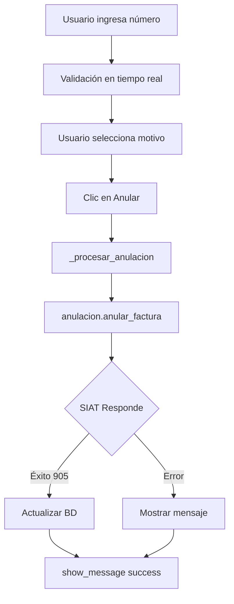
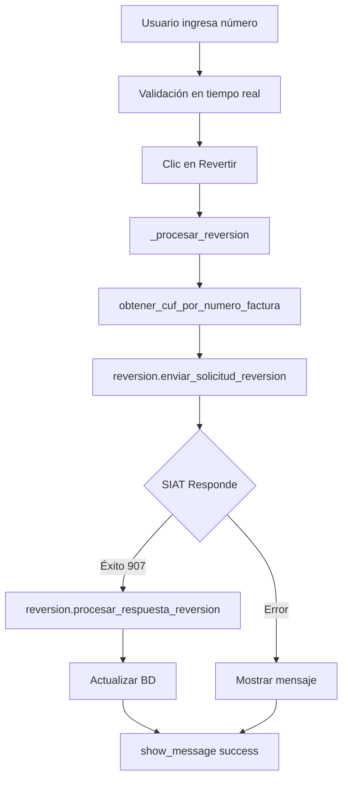

# 🔧 README Técnico - Módulo Anular/Revertir Unificado

## 📌 Información General

**Módulo:** `anular_revertir_tab.py`  
**Ubicación:** `facturador/tabs/`  
**Versión:** 1.0.0  
**Streamlit:** >= 1.37.0 (requiere `st.segmented_control`)  
**Python:** >= 3.8  

---

## 🏗️ Arquitectura del Módulo

### Estructura de Funciones

```
anular_revertir_tab.py
│
├── render()                              [PÚBLICA]
│   ├── Renderiza UI principal
│   ├── Maneja st.segmented_control
│   ├── Muestra información contextual
│   └── Delega a secciones específicas
│
├── _render_seccion_anulacion()           [PRIVADA]
│   ├── UI específica para anulación
│   ├── Dropdown de motivos
│   └── Botón "Anular Factura"
│
├── _render_seccion_reversion()           [PRIVADA]
│   ├── UI específica para reversión
│   ├── Advertencias normativas
│   └── Botón "Revertir Anulación"
│
├── _procesar_anulacion()                 [PRIVADA]
│   ├── Valida campos
│   ├── Llama a anulacion.anular_factura()
│   ├── Procesa respuesta
│   └── Muestra resultado
│
└── _procesar_reversion()                 [PRIVADA]
    ├── Valida campos
    ├── Obtiene CUF
    ├── Llama a reversion.enviar_solicitud_reversion()
    ├── Procesa respuesta
    └── Muestra resultado
```

### Dependencias Externas

```python
# Módulos del sistema
from anulacion import anular_factura
from reversion import enviar_solicitud_reversion, procesar_respuesta_reversion
from data_access import obtener_cuf_por_numero_factura, obtener_motivos_anulacion
from ui_utils import show_message
from logger_config import get_logger

# Bibliotecas externas
import streamlit as st  # >= 1.37.0
```

---

## 🔄 Flujo de Datos

### Anulación



### Reversión



---

## 🎨 Componentes de UI

### 1. Segmented Control

```python
st.segmented_control(
    label="Tipo de operación:",
    options=["Anular Factura", "Revertir Anulación"],
    default="Anular Factura",
    selection_mode="single",
    key="operacion_factura_selector"
)
```

**Estado en session_state:**
- Key: `operacion_factura_selector`
- Valores posibles: `"Anular Factura"` | `"Revertir Anulación"`

### 2. Información Contextual

```python
if operacion == "Anular Factura":
    st.info("ℹ️ **Anulación de Factura**\n...")
else:
    st.info("ℹ️ **Reversión de Anulación**\n...")
```

**Características:**
- Dinámica según selección
- Incluye iconos para mejor UX
- Formato markdown para estructura

### 3. Validación en Tiempo Real

```python
if numero_factura:
    cuf, factura = obtener_cuf_por_numero_factura(numero_factura)
    # Mostrar datos y estado
```

**Triggers:**
- Se ejecuta en cada cambio de `numero_factura`
- Muestra datos de la factura
- Valida coherencia con operación seleccionada

### 4. Campos Condicionales

```python
if operacion == "Anular Factura":
    # Mostrar dropdown de motivos
    descripcion_motivo = st.selectbox(...)
else:
    # Mostrar advertencia sobre reversión única
    st.warning("⚠️ Una factura solo puede ser revertida UNA vez...")
```

---

## 📝 Variables de Estado

### Session State Keys

| Key | Tipo | Propósito |
|-----|------|-----------|
| `operacion_factura_selector` | `str` | Operación seleccionada (Anular/Revertir) |
| `num_factura_anular_factura` | `str` | Número de factura (modo Anular) |
| `num_factura_revertir_anulacion` | `str` | Número de factura (modo Revertir) |
| `motivo_anulacion_selector` | `str` | Motivo seleccionado para anulación |
| `main_active_tab_name` | `str` | Nombre de pestaña activa (para logging) |

**Nota:** Los keys de `num_factura_*` son diferentes según la operación para evitar conflictos de estado.

---

## 🔍 Logging

### Prefijos de Log

```python
"[ANULACIÓN]"  # Operaciones de anulación
"[REVERSIÓN]"  # Operaciones de reversión
```

### Niveles de Log

```python
logger.info()    # Accesos a pestaña, operaciones normales
logger.debug()   # Detalles de operación seleccionada
logger.warning() # Validaciones fallidas, advertencias
logger.error()   # Errores del SIAT, BD, excepciones
```

### Ejemplos

```python
# Acceso a pestaña
logger.info("Usuario accedió a la pestaña 'Gestión de Facturas (Anular/Revertir)'")

# Inicio de operación
logger.info("[ANULACIÓN] Iniciando anulación de factura #123...")

# Éxito
logger.info("[REVERSIÓN] ✅ Exitosa para factura #456...")

# Error
logger.error("[ANULACIÓN] ❌ Error en factura #789: Fuera de plazo")
```

---

## 🧪 Testing

### Unit Tests (Recomendados)

```python
# tests/test_anular_revertir_tab.py

import pytest
from unittest.mock import Mock, patch
from tabs.anular_revertir_tab import (
    _procesar_anulacion,
    _procesar_reversion
)

def test_procesar_anulacion_campos_vacios():
    """Debe mostrar warning si faltan campos."""
    message_placeholder = Mock()
    
    _procesar_anulacion("", None, message_placeholder)
    
    # Verificar que se llamó show_message con 'warning'
    assert message_placeholder.method_calls

def test_procesar_anulacion_exitosa():
    """Debe procesar anulación exitosa."""
    with patch('tabs.anular_revertir_tab.anular_factura') as mock_anular:
        mock_anular.return_value = (True, "Anulación exitosa")
        
        message_placeholder = Mock()
        _procesar_anulacion("123", "Error en datos", message_placeholder)
        
        # Verificar que se llamó a anular_factura
        mock_anular.assert_called_once_with("123", "Error en datos")
```

### Integration Tests

```python
def test_flujo_completo_anulacion(selenium):
    """Test E2E de anulación."""
    # 1. Navegar a pestaña
    selenium.find_element_by_text("Anular o Revertir").click()
    
    # 2. Seleccionar operación
    selenium.find_element_by_text("Anular Factura").click()
    
    # 3. Ingresar datos
    input_factura = selenium.find_element_by_label("Número de factura:")
    input_factura.send_keys("12345")
    
    # 4. Seleccionar motivo
    select_motivo = selenium.find_element_by_label("Seleccione el motivo:")
    select_motivo.select_by_visible_text("Datos incorrectos")
    
    # 5. Confirmar
    btn_anular = selenium.find_element_by_text("🚫 Anular Factura")
    btn_anular.click()
    
    # 6. Verificar resultado
    success_msg = selenium.find_element_by_class("stSuccess")
    assert "exitosa" in success_msg.text.lower()
```

---

## 🐛 Debugging

### Activar Logs de Debug

```python
# En logger_config.py, cambiar nivel:
logger.setLevel(logging.DEBUG)
```

### Verificar Session State

```python
# Añadir al final de render() temporalmente:
with st.expander("🔍 DEBUG: Session State"):
    st.write(st.session_state)
```

### Simular Respuestas del SIAT

```python
# En anulacion.py o reversion.py, mockear respuesta:
def anular_factura(numero, motivo):
    # return False, "Error simulado para testing"
    return True, "Anulación exitosa (SIMULADA)"
```

---

## ⚡ Optimizaciones

### Performance

1. **Caché de motivos de anulación:**
   ```python
   @st.cache_data(ttl=3600)  # 1 hora
   def obtener_motivos_anulacion_cached():
       return obtener_motivos_anulacion()
   ```

2. **Lazy loading de datos de factura:**
   - Solo buscar cuando `numero_factura` tiene al menos 3 caracteres
   - Evitar llamadas en cada keystroke

3. **Debounce en validación:**
   ```python
   if len(numero_factura) >= 3:  # Solo buscar si tiene 3+ dígitos
       cuf, factura = obtener_cuf_por_numero_factura(numero_factura)
   ```

### UX

1. **Placeholder inteligente:**
   ```python
   # Mostrar ejemplo de formato de número
   placeholder="Ejemplo: 12345"
   ```

2. **Autofocus en campo número:**
   ```python
   # (No soportado nativamente en Streamlit, pero se puede con JS)
   ```

3. **Confirmación antes de acción crítica:**
   ```python
   if st.button("Anular Factura"):
       if st.session_state.get('confirm_anular') != True:
           st.session_state['confirm_anular'] = True
           st.warning("⚠️ Confirme haciendo clic nuevamente")
           return
       # Proceder con anulación...
   ```

---

## 🔐 Seguridad

### Validaciones Implementadas

✅ Input sanitization en `numero_factura.strip()`  
✅ Validación de existencia de factura antes de procesar  
✅ Validación de estado coherente con operación  
✅ Logging exhaustivo para auditoría  

### Validaciones Pendientes

⚠️ Rate limiting para evitar spam al SIAT  
⚠️ Validación de permisos por rol de usuario  
⚠️ Confirmación de operaciones críticas  

---

## 📚 Referencias Rápidas

### Códigos de Estado SIAT

**Anulación:**
- `905` = Confirmada ✅
- `906` = Rechazada ❌
- `924` = No existe ❌
- `936` = Ya anulada ❌
- `970` = Fuera de plazo ❌

**Reversión:**
- `907` = Confirmada ✅
- `908` = Rechazada ❌
- `924` = No existe ❌
- `981` = No disponible ❌
- `3011` = No autorizado ❌
- `3012` = Fuera de plazo ❌

### Enlaces Útiles

- [Documentación Streamlit](https://docs.streamlit.io/)
- [Normativa SIAT Anulación](https://siatinfo.impuestos.gob.bo/)
- [Normativa SIAT Reversión](https://siatinfo.impuestos.gob.bo/)

---

## 🤝 Contribución

### Antes de Modificar

1. Leer toda esta documentación
2. Revisar `REFACTOR_ANULAR_REVERTIR.md`
3. Entender normativa del SIN
4. Crear branch: `feature/anular-revertir-mejora-X`

### Guidelines

- Mantener separación de responsabilidades (UI vs lógica)
- Documentar cambios en docstrings
- Añadir logs apropiados
- Actualizar tests
- No romper compatibilidad con `anulacion.py` y `reversion.py`

---

**Última actualización:** 12 de enero de 2025  
**Mantenedor:** Sistema de Facturación
